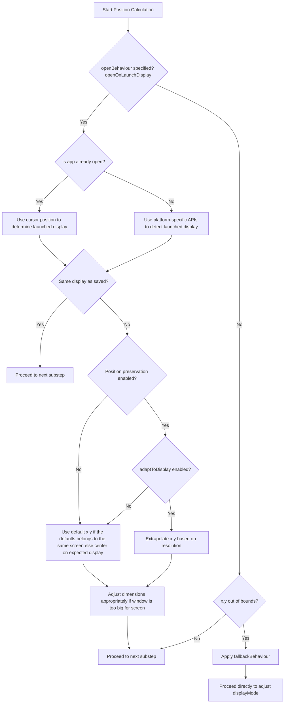
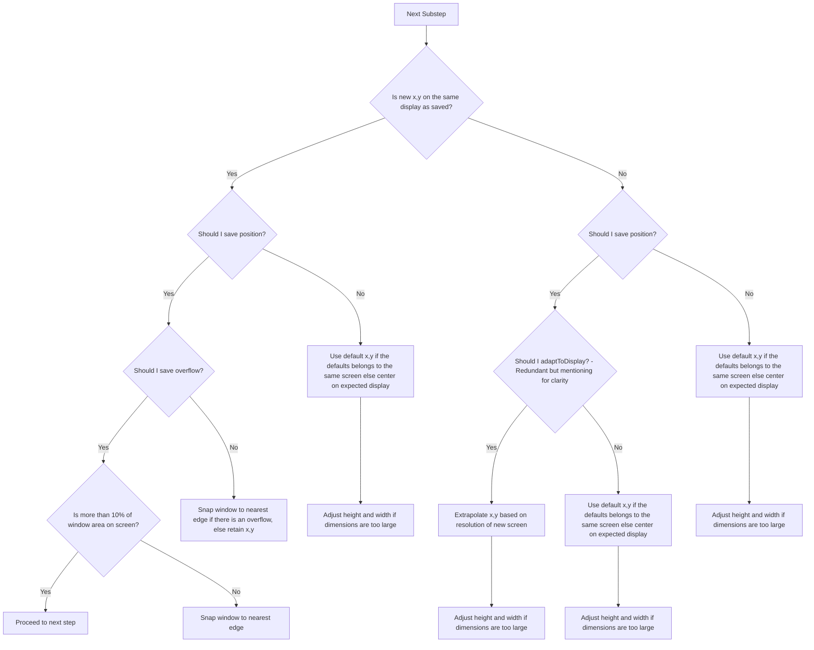

# RFC 
- Start Date: 2025-03-20
- RFC PR: 
- Electron Issues: Related to [electron/electron/issues/526](https://github.com/electron/electron/issues/526)
- Reference Implementation: 
- Status: **Proposed**

> [!NOTE]
> This RFC is part of GSOC 2025 [proposal](https://gist.github.com/nilayarya/48d24e38d8dbf67dd05eef9310f147c6).

# Save/Restore Window State API

Currently, Electron does not have any built-in mechanism for saving and restoring the state of BrowserWindows, but this is a very common need for apps that want to feel more native.

## Summary

This proposal aims to implement a save/restore window state API for Electron by providing a simple but powerful configuration object `windowStateSavePolicy` that handles complex edge cases automatically. This approach offers a declarative way to configure window persistence behavior while maintaining flexibility for different application needs. The object would be optional in the `BrowserWindowConstructorOptions`.

## Motivation

**Why should we do this?**

Window state persistence represents a core functionality that many production Electron apps implement. By elevating it to a first-class feature, Electron acknowledges its essential nature and provides a standardized approach directly in the framework.

**What use cases does it support?** 
 
It's useful for developers who want to implement save/restore window state for their apps reliably. Different apps have different needs. An example use case for this API would be for when apps want to preserve window position (with display overflow) and size across multi-monitor setups with different display scales and resolutions.

`windowStateSavePolicy` aims to cover most save/restore use cases while providing room for future extension.

**What is the expected outcome?**

Electron provides an option to save and restore window state out of the box with multiple configurations which will cover almost all application needs. 

While established applications with custom implementations may continue using their existing solutions, this feature will most likely see adoption by many smaller projects. 

## Implementation Details  

Before diving into the API specifications which is the next section, I’d like to outline the approach for saving a window’s state in Electron.  

We can use Chromium's [PrefService](https://source.chromium.org/chromium/chromium/src/+/main:components/prefs/pref_service.h) to store window state as a JSON object into the already existing Preferences folder inside *app.getPath('userData')*.

We schedule an async write to disk every time a window is moved or resized with a 2.5 second window. If there is change in the window state within the time window, it is reset to 2.5 seconds and we would schedule a write again with the new values. Otherwise, it is written to disk. It is also written to disk on window close synchronously. **This continuous writing approach would enable us to restore the window state even when there are crashes or improper app exits.**

**Questions that might arise:**

**Why 2.5 seconds?**
It seems like a reasonable time window to ensure related window adjustments are batched together. I think we can assume that users are done moving/resizing the window if there is no movement for 2.5 seconds. The default value used by Chromium's PrefService is 10 seconds [[reference](https://source.chromium.org/chromium/chromium/src/+/main:base/files/important_file_writer.cc;l=48;drc=ff37fb5e8b02e0c123063b89ef2ac3423829b010)] which is too long.
I don't think we should make this configurable as well because it's not intuitive to the developer.

**What if the app crashes in the 2.5 second window?** Revert back to where the window was 2.5 seconds before the crash. This wouldn't be the worst user experience in the world.

#### *Why PrefService?*  
- Atomic writes using ImportantFileWriter [[reference](https://source.chromium.org/chromium/chromium/src/+/main:base/files/important_file_writer.h;l=28-29)]
- Async writes which means no blocking of the UI thread, preventing jank during window state updates [[reference](https://docs.google.com/document/d/1rlwl_GvvokatMiRUUkR0vGNcraqe4weFGNilTsZgiXA/edit?tab=t.0#bookmark=id.49710km71rd7)]
- Synchronous writes on demand [[reference](https://source.chromium.org/chromium/chromium/src/+/main:components/prefs/pref_service.h;l=199-209;drc=51cc784590d00e6a95b48e1e1bf5c3fe099edf64)]
- Offers batched scheduled writes (using ImportantFileWriter) every 10 second window [[reference](https://source.chromium.org/chromium/chromium/src/+/main:base/files/important_file_writer.cc;l=48;drc=ff37fb5e8b02e0c123063b89ef2ac3423829b010)]. This is too long for our use-case, but we can conveniently set it to 2.5 seconds
- Already implemented in Electron to preserve the devTools bounds [[reference](https://github.com/electron/electron/blob/73a017577e6d8cf67c76acb8f6a199c2b64ccb5d/shell/browser/ui/inspectable_web_contents.cc#L509)]
- Provides identical behavior across Windows, macOS, and Linux, simplifying implementation and maintenance
- Falls back to default values automatically when corrupted data is encountered [[reference](https://source.chromium.org/chromium/chromium/src/+/main:components/prefs/pref_service.h;l=233-235;drc=51cc784590d00e6a95b48e1e1bf5c3fe099edf64)]
- Safe failing to ensure apps don't crash on data corruption [[reference](https://source.chromium.org/chromium/chromium/src/+/main:components/prefs/json_pref_store.cc;l=91-95;drc=ccea09835fd67b49ef0d4aed8dda1a5f22a409c8)]

<br/>

Here's the schema I propose for the `windowStateSavePolicy` object. This is simply for reference as I have not explained what each field means yet. I will explain each field in the API specification section which is next.

<br/>

`windowStateSavePolicy` schema - This would be passed by the developer in the BrowserWindowConstructorOptions

```json
"windowStateSavePolicy": {
    "stateId": string, 
    "dimensions": boolean,
    "position": {
      "strictDisplay": boolean, 
      "adaptToDisplay": boolean, 
      "allowOverflow": boolean,
      "openBehaviour": string,
      "fallbackBehaviour": string, 
    },
    "displayMode": {
      "strictDisplay": boolean, 
      "maximized": boolean, 
      "minimized": boolean, 
      "fullscreen": boolean, 
      "simpleFullscreen": boolean, __macOS__
      "kiosk": boolean, 
    },
  }
```
> [!NOTE]
> The entire window state (bounds, maximized, minimized, fullscreen, etc.) would be saved internally along with the windowStateSavePolicy object. 
> We would use the saved state and enforce the policy during restoration.

#### **State Persistence Mechanism**  

Firstly, all the window states with their `windowStateSavePolicy` would be to loaded from disk synchronously during the startup process just like other preferences in Electron. Doing so would allow us the have the states in memory during window creation with minimal performance impact. 

Secondly, once the states (containing our save policy) are loaded into memory, we can use them to restore the window state with the `windowStateSavePolicy` rules in place during window creation. An algorithm that handles all the edges would be required for this. I have explained the flow of the algorithm after the API specification. Also, the default options provided in the BrowserWindow constructor options would be overridden (if we are restoring state).

Each time a window is **moved** or **resized**, we schedule a write using Chromium's ScopedDictPrefUpdate [[example](https://github.com/electron/electron/blob/4ad20ccb396a3354d99b8843426bece2b28228bf/shell/browser/ui/inspectable_web_contents.cc#L837-L841)].

#### Developer-Facing Events

I’m also considering emitting events such as: `will-save-window-state`, `saved-window-state`, `will-restore-window-state`, `restored-window-state`. However, I’m unsure about their practical usefulness for developers and hope to finalize them through this RFC.


## API Specification

Here's how it would land in the electron documentation.

### BrowserWindowConstructorOptions

`windowStateSavePolicy` object (optional)
  
  * `stateId` string - A unique identifier used for saving and restoring window state.

  * `dimensions` boolean (optional) - Whether to restore the window's height and width. Fallback is default values. When restoring, window will automatically resize to fit within available screen real estate if height or width is too large. Dimensions will be resaved.

  * `position` object (optional)
    
    * `strictDisplay` boolean (optional) - Whether to restore window position (x, y) only if reopened on the same display (displays are considered the same if they span over the same x, y coordinates and have identical scale, and resolution). Default is `false`.
    
    * `adaptToDisplay` boolean (optional) - Whether to restore window position (x, y) when opened on different displays by coordinate extrapolation based on display resolution. Overrides `strictDisplay` and will position the window at a relatively similar spot on the new display. Default is `false`.

    * `allowOverflow` boolean (optional) - Whether to allow a window to be restored in a partially off-screen position. **Overflow is never preserved in the event of the window opening on a different display.** When `true`, overflow is only persisted if window is relauched on the same display and at least 10% of the window area is visible. If overflow is greater than 90% it will reopen at the closest edge of the display, fully visible. Default is `false`.

    * `openBehaviour` string (optional) - Special behavior when the window is opened.
      * `"openOnLaunchedDisplay"` - Opens the window on the display that it was launched from always.

      * `"openOnPrimaryDisplay"` - Opens the window on the primary display always.

    * `fallbackBehaviour` string (optional) - Fallback behaviour when position is out of bounds [[read more](https://gist.github.com/nilayarya/6a5ae863f99f269f0759f6f4f86e91b5)].
      * `"snapToNearestDisplayEdge"` - Snaps the window to the nearest display edge. It is also the default behaviour when a window is out of bounds and `fallbackBehaviour` is not provided.

      * `"centerOnNearestDisplay"` - Centers the window on the nearest display.

      * `"centerOnPrimaryDisplay"` - Centers the window on the primary display.

  * `displayMode` object (optional) - Controls which display modes will be restored.

    * `strictDisplay` boolean (optional) - Whether to restore `displayMode` only if reopened on the same display. Otherwise, it is always preserved by default even across displays. Default is `false`.
    
    * `maximized` boolean (optional) - Whether to restore maximized state. Default is `false`.
    
    * `minimized` boolean (optional) - Whether to restore minimized state. Default is `false`.
    
    * `fullscreen` boolean (optional) - Whether to restore fullscreen state. Default is `false`.
    
    * `simpleFullscreen` boolean (optional) - Whether to restore simple fullscreen state. Default is `false`.
    
    * `kiosk` boolean (optional) - Whether to restore kiosk state. Default is `false`.
  
  

Example usage that would cover most apps:
```js
const { BrowserWindow } = require('electron')
const win = new BrowserWindow({
  ...existingOptions, 
  windowStateSavePolicy: {
    stateId: '#1230',
    dimensions: true,
    position: {
      strictDisplay: true,
      allowOverflow: true,
      fallbackBehaviour: "snapToNearestDisplayEdge",
    },
    displayMode: {
      maximized: true,
      fullscreen: true,
    },
  },
})
```

### API Design Rationale:
- Everything is set to false by default so that the developer knows what they are toggling.
- Displays are considered the same if they span over the same x, y coordinates and have identical scale, and resolution. So for example, replacing your primary display with same resolution and scale but different manufacturer will still be considered the same display. I think this makes sense.
- A window can never be restored out of reach. I am presuming no apps would want this behavior. `fallbackBehaviour` will take effect if the window is entirely off screen. We are still providing the option to relaunch in a minimized state.
- If window (width, height) reopens on a different display and does not fit on screen auto adjust to fit and resave the value (even if allowOverflow=true). This would reduce the number of edge cases significantly and I highly doubt that any app would want to preserve an overflow when opened on a different display.
- Not handling scaling as Windows, macOS, and Linux support multimonitor window scaling by default.
- Not handling other `displayModes` such as split screen because it's innapropriate I believe. We can restore back to the same bounds in 'normal' mode. I've excluded 'normal' from the options for `displayMode` as it is the default.

### Additional APIs
I also plan on adding synchronous methods to `BrowserWindow` to save, restore, clear, and get the window state or rather window preferences. Down below is the API spec for that.

Here's an exhaustive list of the options that can be saved. It would provide a way to save additional properties on the window apart from the bounds itself.
I think this feature is more of a nice to have and not a must have.

>[!NOTE]
> Restoring these properties would be set in order passed by in the options object. It would be the equivalent of calling the instance methods on BrowserWindow in the same order as provided by the developer. For example, win.setAutoHideMenuBar(true).

#### `win.saveWindowPreferences([options])`

* `options` Object
  
  * `autoHideMenuBar` boolean (optional) - Save window's current autoHideMenuBar state. Default: `false`<span>&nbsp;&nbsp; <kbd>Windows</kbd> <kbd>Linux</kbd></span>
  
  * `focusable` boolean (optional) - Save window's current focusable state. Default: `false`<span>&nbsp;&nbsp; <kbd>Windows</kbd> <kbd>macOS</kbd></span>

  * `visibleOnAllWorkspaces` boolean (optional) - Save window's current visibleOnAllWorkspaces state. Default: `false`<span>&nbsp;&nbsp;  <kbd>macOS</kbd></span>

  * `shadow` boolean (optional) - Save window's current shadow state. Default: `false`

  * `menuBarVisible` boolean (optional) - Save window's current menuBarVisible state. Default: `false`<span>&nbsp;&nbsp; <kbd>Windows</kbd> <kbd>Linux</kbd></span>

  * `representedFilename` boolean (optional) - Save window's current representedFilename. Default: `false`<span>&nbsp;&nbsp; <kbd>macOS</kbd></span>

  * `title` boolean (optional) - Save window's current title. Default: `false`

  * `minimizable` boolean (optional) - Save window's current minimizable state. Default: `false`<span>&nbsp;&nbsp; <kbd>Windows</kbd> <kbd>macOS</kbd></span>

   * `maximizable` boolean (optional) - Save window's current maximizable state. Default: `false`<span>&nbsp;&nbsp; <kbd>Windows</kbd> <kbd>macOS</kbd></span>

  * `fullscreenable` boolean (optional) - Save window's current fullscreenable state. Default: `false`

  * `resizable` boolean (optional) - Save window's current resizable state. Default: `false`

  * `closable` boolean (optional) - Save window's current closable state. Default: `false`<span>&nbsp;&nbsp; <kbd>Windows</kbd> <kbd>macOS</kbd></span>

  * `movable` boolean (optional) - Save window's current movable state. Default: `false`<span>&nbsp;&nbsp; <kbd>Windows</kbd> <kbd>macOS</kbd></span>

  * `excludedFromShownWindowsMenu` boolean (optional) - Save window's current excludedFromShownWindowsMenu state. Default: `false`<span>&nbsp;&nbsp; <kbd>macOS</kbd></span>

  * `accessibleTitle` boolean (optional) - Save window's current accessibleTitle. Default: `false`

  * `backgroundColor` boolean (optional) - Save window's current backgroundColor. Default: `false`

  * `aspectRatio` boolean (optional) - Save window's current aspectRatio. Default: `false`

  * `minimumSize` boolean (optional) - Save window's current minimumSize (width, height). Default: `false`

  * `maximumSize` boolean (optional) - Save window's current maximumSize (width, height). Default: `false`

  * `hiddenInMissionControl` boolean (optional) - Save window's current hiddenInMissionControl state. Default: `false`<span>&nbsp;&nbsp; <kbd>macOS</kbd></span>

  * `alwaysOnTop` boolean (optional) - Save window's current alwaysOnTop state. Default: `false`

  * `skipTaskbar` boolean (optional) - Save window's current skipTaskbar state. Default: `false`<span>&nbsp;&nbsp; <kbd>Windows</kbd> <kbd>macOS</kbd></span>

  * `opacity` boolean (optional) - Save window's current opacity. Default: `false`<span>&nbsp;&nbsp; <kbd>Windows</kbd> <kbd>macOS</kbd></span>

  * `windowButtonVisibility` boolean (optional) - Save window's current windowButtonVisibility state. Default: `false`<span>&nbsp;&nbsp; <kbd>macOS</kbd></span>

  * `ignoreMouseEvents` boolean (optional) - Save window's current ignoreMouseEvents state. Default: `false`

  * `contentProtection` boolean (optional) - Save window's current contentProtection state. Default: `false`<span>&nbsp;&nbsp; <kbd>Windows</kbd> <kbd>macOS</kbd></span>

  * `autoHideCursor` boolean (optional) - Save window's current autoHideCursor state. Default: `false`<span>&nbsp;&nbsp; <kbd>macOS</kbd></span>

  * `vibrancy` boolean (optional) - Save window's current vibrancy state. Default: `false`<span>&nbsp;&nbsp; <kbd>macOS</kbd></span>

  * `backgroundMaterial` boolean (optional) - Save window's current backgroundMaterial state. Default: `false`<span>&nbsp;&nbsp; <kbd>Windows</kbd></span>

  * `windowButtonPosition` boolean (optional) - Save window's current windowButtonPosition state. Default: `false`<span>&nbsp;&nbsp; <kbd>macOS</kbd></span>

  * `titleBarOverlay` boolean (optional) - Save window's current titleBarOverlay state. Default: `false`<span>&nbsp;&nbsp; <kbd>Windows</kbd> <kbd>Linux</kbd></span>

  * `zoomLevel` boolean (optional) - Save window webcontent's current zoomLevel. Default: `false`

  * `audioMuted` boolean (optional) - Save window webcontent's current audioMuted state. Default: `false`

  * `isDevToolsOpened` boolean (optional) - Save window webcontent's current isDevToolsOpened state. Default: `false`

  * `devToolsTitle` boolean (optional) - Save window webcontent's current devToolsTitle. Default: `false`

  * `ignoreMenuShortcuts` boolean (optional) - Save window webcontent's current ignoreMenuShortcuts state. Default: `false`

  * `frameRate` boolean (optional) - Save window webcontent's current frameRate. Default: `false`

  * `backgroundThrottling` boolean (optional) - Save window webcontent's current backgroundThrottling state. Default: `false`
  

Returns `boolean` - Whether the state was successfully saved. Relevant events would be emitted.

```js
const { BrowserWindow } = require('electron')
const win = new BrowserWindow({
  ...existingOptions, 
  windowStateSavePolicy: {
    stateId: '#1230',
    dimensions: true,
    position: {
      strictDisplay: true,
    },
    displayMode: {
      maximized: true,
      fullscreen: true,
    },
  },
});

// Save additional properties
win.saveWindowPreferences({ 
  autoHideMenuBar: true,
  focusable: true,
  visibleOnAllWorkspaces: true,
  shadow: true,
  menuBarVisible: true,
  representedFilename: true,
});
```

#### `win.restoreWindowPreferences()`

Returns `boolean` - Whether the state was successfully restored and applied to the window. Relevant events would be emitted.
Preferences will be restored in the order of the options object passed during savePreferences.
```js
// Restore the previously saved preferences
const success = win.restoreWindowPreferences()
console.log(success) // true if state was successfully restored
```

#### `win.clearSavedState()`

Clears the saved state for the window **including bounds and save policy itself**. Relevant events would be emitted.

```js
// Clear the entire saved state for the window
const success = win.clearSavedState()
console.log(success) // true if state was successfully cleared
```

#### `win.getSavedState()`

Returns `JSON Object` - The saved state for the window including bounds, save policy, and preferences.

```js
// Get the saved state for the window
const savedState = win.getSavedState()
console.log(savedState)
```
Example output:
```json
{
  "display": {
    "id": "#1230",
    "scale": 2.0,
    "resolution": {
      "width": 1920,
      "height": 1080
    }
  },
  "bounds": {
    "width": 800,
    "height": 600,
    "x": 350,
    "y": 400
  },
  "displayMode": {
    "normal": true,
    "maximized": false, 
    "minimized": false, 
    "fullscreen": false, 
    "simpleFullscreen": false,
    "kiosk": false, 
  },
  "windowStateSavePolicy": {}, // Refer to schema below
  "autoHideMenuBar": false,
  "backgroundColor": "#FFFFFF",
  "title": "gsoc2025",
  "minimizable": true,
  "maximizable": true,
  "fullscreenable": true,
  "resizable": true,
  "closable": true,
  "movable": true,
  "excludedFromShownWindowsMenu": true,
  "accessibleTitle": "gsoc2025",
  "aspectRatio": 1.0,
  "minimumSize": {
    "width": 800,
    "height": 600
  },
  "maximumSize": {
    "width": 1000,
    "height": 800
  },
  "hiddenInMissionControl": true, 
}
```
`WindowStateSavePolicy` Schema for reference:
```json
"windowStateSavePolicy": {
    "stateId": string, 
    "dimensions": boolean,
    "position": {
      "strictDisplay": boolean, 
      "adaptToDisplay": boolean, 
      "allowOverflow": boolean,
      "openBehaviour": string,
      "fallbackBehaviour": string,
    },
    "displayMode": {
      "strictDisplay": boolean, 
      "maximized": boolean, 
      "minimized": boolean, 
      "fullscreen": boolean, 
      "simpleFullscreen": boolean, __macOS__
      "kiosk": boolean, 
    },
  }
```

### Algorithm for saving/restoring the window state
As mentioned before, we would take a continuous approach to saving window state if the `windowStateSavePolicy` is passed through the constructor. 

Here's an overview of the algorithm that would run during window restoration:

```
Calculate new dimensions (width, height) ->  Calculate new position (x, y) -> Adjust displayModes based on new (x,y) -> Set window state
```
Each step is further broken down into more steps to accommodate for the many combinations of the `windowStateSavePolicy`.

**Calculate dimensions (width, height):**
If `dimensions` is true then we would use the saved width and height. If `dimensions` is false then we would use the default width and height. We would also check if the restored window has some minimum height, width. I think (100, 100) is reasonable for minimum height, width. Any value less than that would be rounded up to 100.

**Calculate position (x, y):**
Once we have the width and height of the window, we can calculate the position (x, y). 
This part can be tricky as we need to take into account the `strictDisplay`, `adaptToDisplay`, `allowOverflow` parameters and make sure the window is never out of bounds.
I've broken it down into 3 parts for simplicity:

First we would respect the `openBehaviour` and `fallbackBehaviour` parameters.

Let's take `"openOnLaunchDisplay"` as an example `openBehaviour`.

>[!NOTE]
> Multiple displays are represented in a unified coordinate space in Electron's window positioning system. Displays are considered the same if they span over the same x, y coordinates and have identical scale, and resolution. 

>[!NOTE]
> Nothing is set on the window until the final step. When a block says something like 'Snap window to the nearest edge' it means recalculate the x,y that would snap the window to the nearest edge.


<br/>

Second step is the crux of the algorithm and a continuation on the first step. When I refer to the new (x,y) I mean the one 
calculated in the previous step (because x,y could be different due to `openOnLaunchDisplay` in the first step). 
I want to include openOnLaunchDisplay feature because I think it would be a great addition to Electron.



<br/>

>[!NOTE]
> Nothing is set on the window until the final step.

**Adjust displayModes:**
The Algorithm would adjust the `displayModes` based on its `strictDisplay` and recalculated position (x,y). Only if the recalculated position is on the same display as the saved (x,y) we would consider it as being on the same display. This is because displays could change flexibly with `openBehaviour` parameter. If any rules are broken the window will be restored in `normal` mode.

**Set window state:**
Once we have the width, height, x, y, and displayModes we can set the window state. `displayMode` would take precedence over the saved bounds.

## Guide-level explanation

*Explain the feature as if it were already implemented in Electron and you were teaching it to
an Electron app developer.*

Electron is introducing `windowStateSavePolicy`, an optional object in the `BrowserWindowConstructorOptions`.
It can be used to save and restore window state with multiple configurations.

`windowStateSavePolicy` schema - Everything is optional except `stateId`. Developers can choose what they want to preserve and how they want to restore it.

```json
"windowStateSavePolicy": {
    "stateId": string, 
    "dimensions": boolean,
    "position": {
      "strictDisplay": boolean, 
      "adaptToDisplay": boolean, 
      "allowOverflow": boolean,
      "openBehaviour": string,
      "fallbackBehaviour": string,
    },
    "displayMode": {
      "strictDisplay": boolean, 
      "maximized": boolean, 
      "minimized": boolean, 
      "fullscreen": boolean, 
      "simpleFullscreen": boolean, __macOS__
      "kiosk": boolean, 
    },
  }
```

Here's an example that would let you save the dimensions (width, height), and whether the window is maximized, fullscreen. This configuration would **not** restore the window position when reopened.
```js
const { BrowserWindow } = require('electron')
const win = new BrowserWindow({
  ...existingOptions, 
  windowStateSavePolicy: {
    stateId: '#1230',
    dimensions: true,
    displayMode: {
      maximized: true,
      fullscreen: true,
    },
    
  },
})
```
To save the window position, you can set the `position` property to a configurable object that will determine how the window position is restored.

```js
const { BrowserWindow } = require('electron')
const win = new BrowserWindow({
  ...existingOptions, 
  windowStateSavePolicy: {
    stateId: '#1230',
    dimensions: true,
    position: {
      strictDisplay: true,
    },
    displayMode: {
      maximized: true,
      fullscreen: true,
    },
  },
})
```

The above example would save the window position only if it reopens on the same display because `strictDisplay` is true. If `adaptToDisplay` was true it would restore "relative" position even if reopened on a different display.

A window could reopen on a different display due to the `openBehaviour` property which is an option inside the `position` object.

*Discuss how this impacts the ability to read, understand, and maintain Electron code. Will the
proposed feature make Electron code more maintainable? How difficult is the upgrade path for
existing apps?*

It would be the same code for Windows, macOS, and Linux using Chromium's PrefService. I think it would be easy to read, understand, and maintain the new Electron code.

While I'm not sure about this 100%, I don't think it would introduce any breaking changes. I am unclear about the interaction with other features. 

The path to upgrade for apps would be developers removing their existing implementation and using this new API if they want to.


## Reference-level explanation

Covered in the [Implementation Details](#implementation-details) section.


## Drawbacks
- Writing to disk everytime window is moved or resized is not efficient, even though it's batched to a 2.5 second window. It might not be necessary and better to write to disk only on window close synchronously.
- Similar outcomes could be achieved via JavaScript APIs with miniscule performance difference. The only issue being the window state is not set at the right time in the window lifecycle.

Why should we *not* do this?
- It's not a critical issue.
- Adds maintenance burden for the Electron team to support this feature long-term.

## Rationale and alternatives

*Why is this design the best in the space of possible designs?* 
  
  Overall, providing a constructor option is the best design in my opinion. It provides maximum flexibility and future-proofing for different requests in the future. It also sets the window properties at the right time in the window lifecycle. Although not perfect right now, it can be improved by the community based on different use cases quite easily. We're also saving the window state in a continuous manner so it could be restored even after crashes.

*What other designs have been considered and what is the rationale for not choosing them?*
  
  I've considered a JavaScript API that could be used. But it's not the best option since it would be setting the window state again after creation.

*What is the impact of not doing this?*
  
It's not a critical issue. Apps might vanish on rare occasions.

*If this is an API proposal, could this be done as a JavaScript module or a native Node.js add-on?*
  
The real value proposition isn't that this functionality can't be implemented in JavaScript - it absolutely can and has been attempted through various community libraries. Rather, the value lies in providing a standardized, well-maintained solution integrated directly into Electron's core. There's also miniscule performance benefits as it would avoid extra ipc calls while restoring window state. 

## Prior art

Electron devTools persists bounds using PrefService. Implementation can be seen here [inspectable_web_contents.cc](https://github.com/electron/electron/blob/73a017577e6d8cf67c76acb8f6a199c2b64ccb5d/shell/browser/ui/inspectable_web_contents.cc#L509). 
It also seems likely Chrome uses PrefService to store their window bounds [reference](https://chromium.googlesource.com/chromium/src/+/refs/heads/main/chrome/browser/prefs/README.md).

From my research, I found out native applications built directly with the operating system's own tools and frameworks often get window state persistence for free (macOS, Windows).
I thought it would be innapropriate to enforce such rules on Electron apps. Thus, `windowStateSavePolicy` to provide flexibility and the choice to opt-in to this behavior.

## Unresolved questions
*What parts of the design do you expect to resolve through the RFC process before this gets merged?*
- Variable names and the entire API Spec.
- Would there be any breaking changes? I am unclear about the interaction with other features. I would like to know if I'm missing anything.
- 2.5 seconds window appropriate? Should it be configurable? Should we not do this at all and just save it in the end synchronously?
- Should we permit more than 90% overflow of the window area? (I would like to restrict it and snap to the nearest display edge if more than 90% overflow)
- What about other display modes such as split screen? Should we save and restore in the 'normal' display mode with similar dimensions?
- Are there any other edge cases that this proposal missed?

*What parts of the design do you expect to resolve through the implementation of this feature
before stabilization?*

Not much. I would need to figure out if there are platform specific APIs that could be used for properties such as `openOnLaunchDisplay`, `openOnPrimaryDisplay`.

*What related issues do you consider out of scope for this RFC that could be addressed in the
future independently of the solution that comes out of this RFC?*

Other display modes like split screen. I'm not sure if we should handle that. We can save and restore in the 'normal' display mode with similar dimensions.

## Future possibilities

Introduce custom behavior under `fallbackBehaviour` and `openBehaviour` parameters based on community requests.
One particular cool feature would be to provide an option to restore the window on closest available display/space dynamically.

APIs to allow changes in `windowStateSavePolicy` during runtime for apps that want to let users decide save/restore behaviour. 

Overall, the `windowStateSavePolicy` is very configurable so I think it's future-proof. More configurations can be added based on community requests.