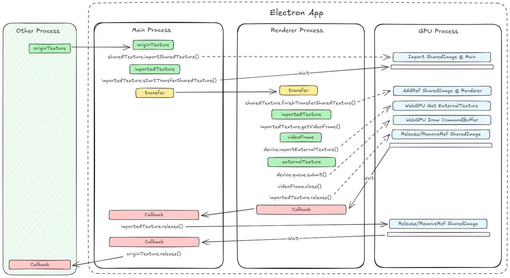

- Start Date: 2025-05-16
- RFC PR: [electron/rfcs#17](https://github.com/electron/rfcs/pull/17)
- Electron Issues: [electron/electron#46779](https://github.com/electron/electron/issues/46779)
- Reference Implementation: [electron/electron#46811](https://github.com/electron/electron/pull/46811)
- Status: **Active**

# Import Shared Texture

## Summary

This feature introduces a way to import a native shared texture handle into Electron, specifically as a [`VideoFrame`](https://developer.mozilla.org/en-US/docs/Web/API/VideoFrame). `VideoFrame` natively supports several web rendering systems, including `WebGPU` and `WebGL`. This enables developers to integrate arbitrary native-rendered content with their web applications.

https://github.com/user-attachments/assets/b09bde3a-d2c5-46c3-b3ef-52dda994eb28

## Motivation

While Offscreen Rendering allows developers to export a shared texture for embedding the browser's output into their own rendering programs efficiently, there are cases where developers may want the reverse: to import images into the browser. For example, broadcasting apps may use this feature to embed various input sources with modern frontend technologies, providing a contemporary user experience. By using shared textures, we can maximize performance and provide a standardized way to bridge images between Electron and native rendering programs.

## API Design

### Module

A new `sharedTexture` module will be added, available in both the sandboxed renderer process and the main process. This module provides the primary interface for importing external shared texture handles. The module handles lifetime management automatically, while still providing subtle APIs for advanced users.

### Methods

#### `sharedTexture.importSharedTexture(options)` _Experimental_

> This method is only available in the main process.

* `options` Object - Options for importing a shared texture.
  * `textureInfo` [SharedTextureImportTextureInfo](#sharedtextureimporttextureinfo-object) - The information of shared texture to import.
  * `allReferenceReleased` Function (optional) - Called when all references in all processes are released, you should keep native texture valid until this callback is called.

Imports the shared texture from the given options.

Returns `SharedTextureImported` - The imported shared texture.

#### `sharedTexture.sendSharedTexture(options, ...args)` _Experimental_

> This method is only available in the main process.

* `options` Object - Options for sending a shared texture.
  * `frame` [WebFrameMain](web-frame-main.md) - The target frame to transfer the shared texture to. For `WebContents` you can pass `webContents.mainFrame`. If you provide a `webFrameMain` that is not a main frame, you'll need to enable `webPreferences.nodeIntegrationInSubFrames` for this, since this feature requires [IPC](https://www.electronjs.org/docs/latest/api/web-frame-main#frameipc-readonly) between main and the frame.
  * `importedSharedTexture` [SharedTextureImported](#sharedtextureimported-object) - The imported shared texture.
* `...args` any[] - Additional arguments to pass to the renderer process.

Send the imported shared texture to a renderer process. You must register a receiver in the renderer process before calling this method. This method has a 1000ms timeout; ensure the receiver is set and the renderer process is alive before calling this method.

Returns `Promise<void>` - Resolves when the transfer completes.

#### `sharedTexture.setSharedTextureReceiver(callback)` _Experimental_

> This method is only available in the renderer process.

* `callback` Function\<Promise\<void\>\> - The function to receive the imported shared texture.
  * `receivedSharedTextureData` Object - The data received from the main process.
    * `importedSharedTexture` [SharedTextureImported](#sharedtextureimported-object) - The imported shared texture.
  * `...args` any[] - Additional arguments passed from the main process.

Set a callback to receive imported shared textures from the main process.

### Properties

#### `sharedTexture.subtle` [SharedTextureSubtle](#sharedtexturesubtle-object)

Provides subtle APIs to interact with an imported shared texture for advanced users.

### Structures

#### SharedTextureImportTextureInfo Object

* `pixelFormat` string - The pixel format of the texture.
* `colorSpace` [ColorSpace](https://github.com/electron/electron/blob/main/docs/api/structures/color-space.md) (optional) - The color space of the texture.
* `codedSize` [Size](https://github.com/electron/electron/blob/main/docs/api/structures/size.md) - The full dimensions of the shared texture.
* `visibleRect` [Rectangle](https://github.com/electron/electron/blob/main/docs/api/structures/rectangle.md) (optional) - A subsection of [0, 0, codedSize.width, codedSize.height]. In common cases, it is the full section area.
* `timestamp` number (optional) - A timestamp in microseconds that will be reflected to `VideoFrame`.
* `handle` [SharedTextureHandle](#sharedtexturehandle-object) - The shared texture handle.

#### SharedTextureImported Object

* `textureId` string - The unique identifier of this imported shared texture.
* `getVideoFrame` Function\<[VideoFrame](https://developer.mozilla.org/en-US/docs/Web/API/VideoFrame)\> - Create a `VideoFrame` that uses the imported shared texture in the current process. You can call `VideoFrame.close()` once you've finished using it; the underlying resources will wait for GPU completion internally.
* `release` Function - Release this object's reference to the imported shared texture. The underlying resource will be alive until every reference is released.
* `subtle` [SharedTextureImportedSubtle](#sharedtextureimportedsubtle-object) - Provides subtle APIs to interact with imported shared texture for advanced users.

#### SharedTextureSubtle Object

* `importSharedTexture` Function\<[SharedTextureImportedSubtle](#sharedtextureimportedsubtle-object)\> - Imports the shared texture from the given options. Returns the imported shared texture.
  * `textureInfo` [SharedTextureImportTextureInfo](#sharedtextureimporttextureinfo-object) - The information of shared texture to import.
* `finishTransferSharedTexture` Function\<[SharedTextureImportedSubtle](#sharedtextureimportedsubtle-object)\> - Finishes the transfer and returns the imported shared texture from the transfer object.
  * `transfer` [SharedTextureTransfer](#sharedtexturetransfer-object) - The transfer object of the shared texture.

#### SharedTextureSyncToken Object

* `syncToken` string - Opaque data for the sync token.

#### SharedTextureTransfer Object

* `transfer` string - Opaque transfer data for the shared texture; can be transferred across Electron processes.
* `syncToken` string - The opaque sync token data for frame creation.
* `pixelFormat` string - The pixel format of the texture.
* `codedSize` [Size](https://github.com/electron/electron/blob/main/docs/api/structures/size.md) - The full dimensions of the shared texture.
* `visibleRect` [Rectangle](https://github.com/electron/electron/blob/main/docs/api/structures/rectangle.md) - A subsection of [0, 0, codedSize.width, codedSize.height]. In common cases, it is the full section area.
* `timestamp` number - A timestamp in microseconds that will be reflected to `VideoFrame`.

Do not modify any property; use `sharedTexture.subtle.finishTransferSharedTexture` to get [`SharedTextureImported`](#sharedtextureimported-object) back.

#### SharedTextureImportedSubtle Object

* `getVideoFrame` Function\<[VideoFrame](https://developer.mozilla.org/en-US/docs/Web/API/VideoFrame)\> - Create a `VideoFrame` that uses the imported shared texture in the current process. You can call `VideoFrame.close()` once you've finished using it; the underlying resources will wait for GPU completion internally.
* `release` Function - Release the resources. If you transferred and obtained multiple `SharedTextureImported`, you must call `release` on each of them. The resource in the GPU process will be finally destroyed when the last one is released.
  * `callback` Function (optional) - Callback when GPU command buffer finished using this shared texture. It provides a precise event to safely release dependent resources. For example, if this object is created by `finishTransferSharedTexture`, you can use this callback to safely release the original one that called `startTransferSharedTexture` in other processes. You can also release the source shared texture that was used to `importSharedTexture` safely.
* `startTransferSharedTexture` Function\<[SharedTextureTransfer](#sharedtexturetransfer-object)\> - Create a `SharedTextureTransfer` that can be serialized and transferred to other processes.
* `getFrameCreationSyncToken` Function\<[SharedTextureSyncToken](#sharedtexturesynctoken-object)\> - For advanced users. Typically called after `finishTransferSharedTexture`, and passed to the object that called `startTransferSharedTexture` to prevent the source object from releasing the underlying resource before the target object actually acquires the reference in the GPU process asynchronously.
* `setReleaseSyncToken` Function - For advanced users. If used, this object's underlying resource will not be released until the set sync token is fulfilled in the GPU process. By using sync tokens, users are not required to use release callbacks for lifetime management.
  * `syncToken` [SharedTextureSyncToken](#sharedtexturesynctoken-object) - The sync token to set.

#### SharedTextureHandle Object

* `ntHandle` Buffer (optional) _Windows_ - NT HANDLE holds the shared texture. Note that this NT HANDLE is local to the current process.
* `ioSurface` Buffer (optional) _macOS_ - IOSurfaceRef holds the shared texture. Note that this IOSurface is local to the current process (not global).
* `nativePixmap` Object (optional) _Linux_ - Structure contains planes of shared texture.
  * `planes` Object[] _Linux_ - Each plane's info of the shared texture.
    * `stride` number - The strides and offsets in bytes to be used when accessing the buffers via a memory mapping. One per plane per entry.
    * `offset` number - The strides and offsets in bytes to be used when accessing the buffers via a memory mapping. One per plane per entry.
    * `size` number - Size in bytes of the plane. This is necessary to map the buffers.
    * `fd` number - File descriptor for the underlying memory object (usually dmabuf).
  * `modifier` string _Linux_ - The modifier is retrieved from GBM library and passed to EGL driver.
  * `supportsZeroCopyWebGpuImport` boolean _Linux_ - Indicates whether zero-copy import to WebGPU is supported.

## Guide-level explanation

### Managed API Example Usage Walkthrough

In this section, we will use the output of offscreen rendering as an example of an external shared texture, importing and rendering it in another window. We use the managed version of the API for easier lifetime management. 

1. Import the `sharedTexture` module.

```js
const { sharedTexture } = require('electron');
```

2. Create a `BrowserWindow` and enable the offscreen rendering feature, setting the target window size.

```js
const osr = new BrowserWindow({
  show: true,
  webPreferences: {
    offscreen: {
      useSharedTexture: true
    }
  }
});

// It is recommended to use `setSize`, as setting width and height above in BrowserWindow may be constrained by the screen size.
osr.setSize(3840, 2160)
```

3. Listen for the `paint` event, import the shared texture, and get a transfer object to pass to the renderer process.

The `handle` is a [SharedTextureHandle](#sharedtexturehandle-object), which contains platform-specific information about the native handle.

```js
osr.webContents.on('paint', async (event) => {
  const texture = event.texture;

  if (!texture) {
    return;
  }

  // Import the external shared texture
  // `textureInfo` has same properties as `importSharedTexture` required,
  // for importing your own native shared texture, fill corresponding 
  // properties by yourself.
  const imported = sharedTexture.importSharedTexture({
      textureInfo: texture.textureInfo,
      // This will be called when all references of the imported shared
      // texture are released. When this is called, you can safely release
      // the source native texture.
      allReferenceReleased() {
        // All references are released, release the source texture.
        texture.release()
      }
  });

  // Use the util method to transfer to the renderer process
  // This has a timeout to prevent your renderer being dead or not having
  // registered receiver with `sharedTexture.setSharedTextureReceiver`.
  await sharedTexture.sendSharedTexture({
    frame: win.webContents.mainFrame,
    importedSharedTexture: imported
  });

  // You can release here as we're done using it in the main process. 
  // The receiver will need to call `release()` at the end of their usage.
  // The underlying resource will keep alive until all holders called
  // `release()`, and references are managed automatically to track when all
  // holders are released.
  imported.release();
});
```

4. In `preload.js`, expose an API to the main world and receive the transfer object.

```js
const { sharedTexture } = require('electron');
const { contextBridge } = require('electron/renderer');

contextBridge.exposeInMainWorld('textures', {
  setSharedTextureReceiver: (cb) => {
    sharedTexture.setSharedTextureReceiver(async (data) => {
      // Provide the imported shared texture to the renderer process
      await cb(data.importedSharedTexture);
    });
  }
});
```

5. In `renderer.js`, prepare a canvas and a WebGPU rendering pipeline.

<details>

<summary> WebGPU Rendering Pipeline Initialization Code </summary>

```js
// Import WebGPU utilities
const canvas = document.createElement('canvas');
canvas.width = 128;
canvas.height = 128;
canvas.style.width = '128px';
canvas.style.height = '128px';

document.body.appendChild(canvas);
const context = canvas.getContext('webgpu');

const initWebGpu = async () => {
  // Configure WebGPU context
  const adapter = await navigator.gpu.requestAdapter();
  const device = await adapter.requestDevice();
  const format = navigator.gpu.getPreferredCanvasFormat();
  context.configure({ device, format });

  // Create a function to render VideoFrame
  window.renderFrame = async (frame) => {
    try {
      // Create external texture
      const externalTexture = device.importExternalTexture({ source: frame });

      // Create bind group layout, specifying the external texture type
      const bindGroupLayout = device.createBindGroupLayout({
        entries: [
          {
            binding: 0,
            visibility: window.GPUShaderStage.FRAGMENT,
            externalTexture: {}
          },
          {
            binding: 1,
            visibility: window.GPUShaderStage.FRAGMENT,
            sampler: {}
          }
        ]
      });

      // Create pipeline layout
      const pipelineLayout = device.createPipelineLayout({
        bindGroupLayouts: [bindGroupLayout]
      });

      // Create render pipeline
      const pipeline = device.createRenderPipeline({
        layout: pipelineLayout,
        vertex: {
          module: device.createShaderModule({
            code: `
                @vertex
                fn main(@builtin(vertex_index) VertexIndex : u32) -> @builtin(position) vec4<f32> {
                var pos = array<vec2<f32>, 6>(
                    vec2<f32>(-1.0, -1.0),
                    vec2<f32>(1.0, -1.0),
                    vec2<f32>(-1.0, 1.0),
                    vec2<f32>(-1.0, 1.0),
                    vec2<f32>(1.0, -1.0),
                    vec2<f32>(1.0, 1.0)
                );
                return vec4<f32>(pos[VertexIndex], 0.0, 1.0);
                }
            `
          }),
          entryPoint: 'main'
        },
        fragment: {
          module: device.createShaderModule({
            code: `
                @group(0) @binding(0) var extTex: texture_external;
                @group(0) @binding(1) var mySampler: sampler;
                @fragment
                fn main(@builtin(position) fragCoord: vec4<f32>) -> @location(0) vec4<f32> {
                let texCoord = fragCoord.xy / vec2<f32>(${canvas.width}.0, ${canvas.height}.0);
                return textureSampleBaseClampToEdge(extTex, mySampler, texCoord);
                }
            `
          }),
          entryPoint: 'main',
          targets: [{ format }]
        },
        primitive: { topology: 'triangle-list' }
      });

      // Create bind group
      const bindGroup = device.createBindGroup({
        layout: bindGroupLayout,
        entries: [
          {
            binding: 0,
            resource: externalTexture
          },
          {
            binding: 1,
            resource: device.createSampler()
          }
        ]
      });

      // Create command encoder and render pass
      const commandEncoder = device.createCommandEncoder();
      const textureView = context.getCurrentTexture().createView();
      const renderPass = commandEncoder.beginRenderPass({
        colorAttachments: [
          {
            view: textureView,
            clearValue: { r: 0.0, g: 0.0, b: 0.0, a: 1.0 },
            loadOp: 'clear',
            storeOp: 'store'
          }
        ]
      });

      // Set pipeline and bind group
      renderPass.setPipeline(pipeline);
      renderPass.setBindGroup(0, bindGroup);
      renderPass.draw(6); // Draw a rectangle composed of two triangles
      renderPass.end();

      // Submit commands
      device.queue.submit([commandEncoder.finish()]);
    } catch (error) {
      console.error('Rendering error:', error);
    }
  };
};

initWebGpu().catch((err) => {
  console.error('Failed to initialize WebGPU:', err);
});
```

</details>

6. Obtain a `VideoFrame` from the imported shared texture and render it. After submitting the WebGPU command buffer, you can call `close` on the `VideoFrame`.

```js
window.textures.setSharedTextureReceiver(async (imported) => {
  try {
    // Get VideoFrame from the imported texture
    const frame = imported.getVideoFrame();

    // When it's done using, release the imported shared texture.
    imported.release();

    // Render using WebGPU
    await window.renderFrame(frame);

    // Release the VideoFrame as it is no longer needed.
    // You can `close()` the frame after the `imported` called
    // `release()`. The resource will be automatically managed.
    frame.close();
  } catch (error) {
    console.error('Error getting VideoFrame:', error);
  }
});
```

This managed API will automatically handle IPC and reference counting for users. When all holders in different processes called `release()`, the resource will be automatically released. However, if advanced user wants to access raw APIs, they can use `subtle` property to access them. For more details, please take [the test](https://github.com/electron/electron/blob/main/spec/api-shared-texture-spec.ts) as an example.

## Reference-level explanation

### Managed API Design

The managed API is designed to be easy to use for most users. It automatically handles IPC and reference counting for users, which is a pain for users to manually manage.

1. It automatically passes sync tokens through Electron IPC, with an async API.
2. It automatically counts references across processes, and detects if there's a leak.
3. It provides a clearer API for users to use, and is easier to understand.

### Subtle API Design Considerations

The main goal of the current implementation is to import external shared texture descriptions while reusing as much of the existing Chromium infrastructure as possible to minimize maintenance burden. `SharedImage` is chosen as the underlying holder of the external texture because it provides `SharedImageInterface::CreateSharedImage`, which accepts a `GpuMemoryBufferHandle` containing native shared handle types: `NTHANDLE` for Windows, `IOSurfaceRef` for macOS, and `NativePixmapHandle` with file descriptors for each plane for Linux. However, during research, several critical problems led to the final design described below.

#### Shared handle is local to process

On Windows, a shared D3D11 texture can be created by `GetSharedHandle` (deprecated) or `CreateSharedHandle`. The deprecated method generates a `non-NTHANDLE` that can be globally accessed, while the newer one generates an `NTHANDLE` that is local to the current process. To share it with other processes, you need to call `DuplicateHandle` to create this handle in the remote process.

On macOS, `IOSurface` can also be global by setting `kIOSurfaceIsGlobal`, which is now deprecated. To share an `IOSurface` with other processes, you need to create a `mach_port` from it and pass the `mach_port` through a previously created IPC (which also uses `mach_port` as transport), making it significantly more complex than on Windows.

Given these obstacles, you must ensure that when calling `sharedTexture.importSharedTexture`, the handle is already available to the current process. You might be able to use a global `IOSurface`, but a `non-NTHANDLE` is not an option as described in problem 2 below.

In fact, Chromium's IPC internally handles all these concerns (duplicating handles for remote processes, passing `mach_port` through `mach_port`), which is why the OSR `paint` event can use the handle directly in the main process, even though the original handle is generated in the GPU process—because IPC has transparently handled these issues.

#### Shared handle ownership management

Chromium takes ownership of the `GpuMemoryBuffer` and its native representation. Once the resource is destroyed, the handle will be closed. Thus, the handle the user imports must allow Chromium to take ownership.

On Windows, calling `CloseHandle` on a `non-NTHANDLE` is invalid and will cause Chromium to crash. Therefore, you cannot use a `non-NTHANDLE` when importing. In the future, we may provide a helper for this. To work with this design, when calling `importSharedTexture`, an `NTHANDLE` will be duplicated internally for the user, meaning the user still has ownership of the handle.

On macOS, `IOSurface` is a reference-counted resource. When calling `importSharedTexture`, instead of taking ownership, Chromium can simply retain this resource and increment the reference count, so the user still retains ownership.

#### Transferring the shared texture between processes

Initially, I considered using the WebGPU Dawn Native API to import the external texture as a `WGPUSharedTextureMemory`, but encountered several problems. For example, it was unable to export, difficult to manage the lifetime of a frame, and working with WebGPU was non-ideal.

`SharedImage` has advantages for sharing across processes because it holds a reference to a `Mailbox`, which points to the corresponding `SharedImageBacking` in the GPU process. Therefore, I use `SharedImageInterface::ImportSharedImage` and `ClientSharedImage::Export` to serialize sufficient information to retrieve the `SharedImage` reference in another process, and it can also reuse the mojo serializer to serialize as a string. Everything is handled by Chromium.

Lifecycle management is a bit tricky. When you get a `SharedImage` holding a `Mailbox` from either `ImportSharedImage` or `CreateSharedImage`, the `Mailbox` is just a placeholder; it doesn't ensure the GPU has actually imported the texture and increased the reference count to the `Mailbox`. Chromium doesn't wait for the GPU to finish, typically using a `SyncToken` to ensure GPU task dependencies. For example, releasing a `SharedImage` is also an asynchronous operation, and calling release often requires a `SyncToken` that acts as a barrier to ensure all GPU importing and rendering tasks are finished. In our case, since we can't use a mojo callback to update the `SyncToken` across processes, we use callbacks to notify dependent resources to release.

#### Interprocess resource management

The final challenge is managing the lifetime of a frame. Currently, I use OSR to get an exported shared texture generated by Chromium itself. As the documentation states, the texture needs to be manually released. By importing this texture into a `SharedTextureImported` in Electron, we must ensure the imported one is released before the source texture is released.

What's more challenging is that the `paint` event occurs in the main process, while rendering must occur in renderer processes, so we must use `startTransferSharedTexture` to pass the underlying `SharedImage` to another process.

Most GPU calls are asynchronous, sent to the GPU process's command buffer through the `GpuChannel` of each client process. When we have two `SharedImage` instances referencing the same `Mailbox` in two different processes, we don't know when the GPU has finished using the resources. Typically, this is guaranteed by a `SyncToken`. For example, we can schedule the destruction of a `SharedImage` with an empty `SyncToken` in the main process (where the texture was first imported), but when we use the same `SharedImage` in the renderer process and use it in WebGPU (or WebGL) pipelines, the destruction token will be generated by WebGPU to prevent destruction before the GPU uses it. The destruction won't occur until WebGPU rendering finishes.

Ideally, if we were in Chromium, we could use mojo to create a `PendingRemote` callback and update the main process destruction `SyncToken` to prevent the main process from releasing the frame before the GPU starts working on it. In the future, we may implement this in Electron code to wrap the mojo functionality. Eventually, I found a way to use `gpu::ContextSupport` and register a callback when a specific `SyncToken` is released (signaled). When you call `release()` on the imported shared texture object, if you've used `VideoFrame` and imported it into a WebGPU pipeline, it will wait for WebGPU to finish rendering, then run a callback to notify you to release dependent resources, such as the original imported object in the main process, the source texture, etc.

#### Copy source texture

Making a copy of the source texture at import time was also considered, but it's not ideal. First, it introduces an extra copy and doubles GPU memory usage. Second, performance suffers if we make the user wait for the copy to complete. Thus, we choose not to provide a copy option and encourage users to listen for the `allReferenceReleased` callback to release the source texture.

#### Cautions of lifecycle management

The `subtle` property exposes raw APIs to the advanced users. If `subtle` APIs are used, the lifecycle of objects must be carefully managed:

1. First, obtain an external shared texture, in this example from offscreen rendering, referred to as `originTexture`.
2. Import `originTexture` to get `importedTextureMain`.
3. Obtain a `transferObject` from `importedTextureMain` and send it through the IPC channel.
4. **Caution**: At this point, you cannot release `importedTextureMain` as the import in the other process is not yet complete.
5. Receive the `transferObject` in the renderer process and obtain `importedTextureRenderer`.
6. **Caution**: At this point, you also cannot release `importedTextureMain`, as GPU tasks are asynchronous. All `importedTexture` objects are backed by a `Mailbox`, which has a cross-process reference counter in the GPU process. The counter will not increase until the command buffer actually runs the `importedTextureRenderer` import task. Thus, if you release `importedTextureMain` now, the counter may reset to zero, causing the GPU to destroy the mailbox and making the future import task fail.
7. Obtain a `VideoFrame` from `importedTextureRenderer`, use it in WebGPU, and create an `ExternalTexture`.
8. After submitting the command buffer, all GPU tasks are submitted. You can safely call `close` on the `VideoFrame`, as the command is guaranteed to execute after all submitted tasks, ensured by a `SyncToken` (explained in detail later).
9. For similar reasons, you can then call `release` on `importedTextureRenderer`, as all tasks in the renderer process are complete. Pass a callback to the `release` function, which uses a `SyncToken` internally to ensure the callback is triggered after all submitted tasks are executed by the GPU, making it safe to release further resources.
10. Now, notify the main process to release `importedTextureMain`. It is recommended to also use a callback to safely release `originTexture`.



### New Dependencies

This feature mainly depends on the `SharedImage` API in Chromium.

## Drawbacks

Chromium's `SharedImage` may have minor API changes in the future. For example, `VideoFrame` might eventually manage the lifetime of the underlying `SharedImage` automatically (which is actually more ideal), but this could introduce minor maintenance burdens.

## Rationale and alternatives

### Rationale

This design is nearly optimal, as it requires no upstream patches and already takes into account all Chromium internal design constraints.

### Alternatives

Besides using `VideoFrame`, one possible alternative is to use `WebGPU` directly, which would require significant patches to Dawn and Chromium, and was therefore abandoned.

Regarding lifecycle management, I considered passing callbacks like `MessagePort` does. After some research, although it is possible to create an IPC channel using the Blink `MessagePortDescriptor`, I found this does not simplify things much:

- You still have to ensure the remote process has finished calling `finishTransferSharedTexture` (that's when it transmits a new SyncToken back), before you can drop the reference or call release. It's still an asynchronous procedure.
- You still don't know when to release the original native handle. A callback is still needed to notify a safe release.

Therefore, I decided not to use automated `SyncToken` IPC, and to continue using the release callback to provide a precise and safe timing for manually releasing dependencies.

## Prior art

Previously, users could import external images via video streams or bitmaps, which consumed CPU and resulted in visual loss. By using shared textures, we can import GPU resources directly, which is a much more efficient way to display arbitrary content in web applications.

## Unresolved questions

- How to handle native shared handles: can we provide this feature in sandboxed renderer processes?
- Are there any other web standards besides `VideoFrame` that can be used to render the texture?

## Future possibilities

- Performance: It would be meaningful to profile the overhead of managing the lifecycle through Electron IPC callbacks.
- Provide a utility method to let users import a global `IOSurface` or global D3D11 `HANDLE`.
- Since we can import a shared texture as a `SharedImage`, it may be possible to implement OSR using `SharedImage` instead of `FrameSinkVideoCapturer`.
