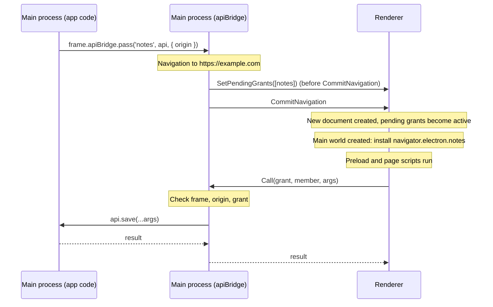

# apiBridge: Pass APIs from the main process to web pages

- Start Date: 2026-09-11
- RFC PR: [electron/rfcs#32](https://github.com/electron/rfcs/pull/32)
- Electron Issues: [electron/electron#0000](https://github.com/electron/electron/issues/0000)
- Reference Implementation: [electron/electron#53832](https://github.com/electron/electron/pull/53832)
- Status: **Proposed**

## Summary

apiBridge is a new way for the main process to give a web page an API. The main process passes a
plain object to a frame, or to all windows of a session. The page gets the object as
`navigator.electron.<name>`, before the first script of the page runs. apiBridge does not use a
preload script, `contextBridge` or channel names.

Each API has a list of frames and origins. The main process checks each call against this list,
in native code. Functions on the object become async methods. Three helpers add synchronous
methods, events and stores. A store holds state that the page reads without a message to the
main process. A page that does not have an API sees no change.

```js
// Main process
win.webContents.mainFrame.apiBridge.pass('notes', {
  save: (text) => writeNote(text)
}, { origin: 'https://example.com' })
```

```js
// Web page
await navigator.electron.notes.save('Hello')
```

## Motivation

### Use cases

The most frequent use of IPC in Electron apps is to give a web page access to functions that
only the main process has. Examples:

- Read and write files. For example, a notes app saves a document.
- Show native dialogs and menus.
- Control the window. For example, the page closes or minimizes its window.
- Share state with all windows. For example, the theme or the signed-in user.
- Tell the page about a change in the main process. For example, a file changed on disk.
- Give the preload script data that the page must not see. For example, an auth token.

### The current pattern needs three files

Today, one API method needs three parts. The three parts must use the same channel name:

```js
// main.js
ipcMain.handle('notes:save', async (event, text) => {
  const url = new URL(event.senderFrame.url)
  if (url.origin !== 'https://example.com') throw new Error('Not allowed')
  if (event.senderFrame.parent) throw new Error('Not allowed')
  await writeNote(text)
})

// preload.js
contextBridge.exposeInMainWorld('notes', {
  save: (text) => ipcRenderer.invoke('notes:save', text)
})

// page
await window.notes.save('Hello')
```

An app with many methods repeats this pattern for each method.

### Security checks are manual

`ipcMain.handle` receives messages from all frames in all windows. Thus, the handler must check the
sender. Apps frequently do not do this check. Then an iframe, an ad, or a page that the window
navigated to can call the most powerful code of the app. Electron's [security
checklist](https://www.electronjs.org/docs/latest/tutorial/security#17-validate-the-sender-of-all-ipc-messages)
tells developers to validate the sender of each message, because the platform does not do it.

### Calls are slower than necessary

A call in this pattern crosses two JavaScript boundaries before it gets to IPC:

1. `contextBridge` copies the arguments from the world of the page to the world of the preload.
2. `ipcRenderer` serializes the arguments again.

In the main process, several `EventEmitter`s dispatch the message by channel name before it gets
to the handler. To read a value that the main process already has, the page must do a full round
trip each time.

### Userland solutions are not sufficient

[@marshallofsound/ipc](https://github.com/MarshallOfSound/ipc) makes the three parts from a
schema. It adds origin and frame validators, events and stores. It removes the boilerplate and
shows which primitives developers want. But a userland library cannot solve the other problems:

- It uses `ipcRenderer` and `contextBridge`. Because of this, calls are not faster.
- It needs a preload script and a code generation step.
- It checks origins in JavaScript, with data that the renderer can influence.

### Goals

- One call in the main process gives a page an API. No preload, bridge or channel is necessary.
- The platform decides which frames can call an API. It checks each call in native code.
- The API is available before the first script of the page runs.
- Calls are faster than `ipcRenderer.invoke` through `contextBridge`. A page reads shared state
  without a call.
- One API object can serve many windows.
- A page that does not have an API cannot use apiBridge to find out that it runs in Electron.

### Non-goals

- apiBridge does not replace or deprecate `ipcMain`, `ipcRenderer` or `contextBridge`. They do not
  change.
- apiBridge does not validate argument types. Values arrive as plain data. The app must check what
  the values mean.
- apiBridge does not support workers or service workers. See
  [Future possibilities](#future-possibilities).

## Guide-level explanation

### Pass an API to a frame

An API is a plain object. To give an API to a frame, call
`frame.apiBridge.pass(name, api, options)`:

```js
// main.js
const { app, BrowserWindow } = require('electron')

app.whenReady().then(() => {
  const win = new BrowserWindow()

  win.webContents.mainFrame.apiBridge.pass('notes', {
    getVersion: () => app.getVersion(),
    save: async (text) => {
      await writeNote(text)
      return true
    }
  }, { origin: 'https://example.com' })

  win.loadURL('https://example.com')
})
```

The page can use the API immediately. The page does not need a preload script:

```js
// A script on https://example.com
const { notes } = navigator.electron
console.log(await notes.getVersion())
await notes.save('Hello')
```

The `origin` option sets which documents get the API. In this example, only documents from
`https://example.com` in the main frame of the window get `navigator.electron.notes`. If the
window navigates to a different origin, the API is not available there. If the window navigates
back, the API is available again.

If you do not set `origin`, the API uses the origin of the document that the frame shows when you
call `pass()`. Before a window loads a page, it has no origin. Thus, to pass an API before the
first load, you must set `origin`.

### What an API can contain

The page gets one member for each own enumerable property of the object:

| Property on the API | Member that the page gets |
| --- | --- |
| A function | A function that returns a `Promise` for the result. If your function throws or rejects, the promise rejects with an error that has the same `name` and `message`. |
| `apiBridgeMain.sync(fn)` | A function that returns the result directly. The page waits until `fn` returns, or until the promise of `fn` settles. |
| `apiBridgeMain.withCaller(fn)` | A function that returns a `Promise`. `fn` also gets the frame that called it. See [Find the frame that called](#find-the-frame-that-called). |
| `apiBridgeMain.event()` | `{ on(listener) }`. `on` returns a function that removes the listener. The main process calls `event.emit(...args)`. |
| `apiBridgeMain.store(value)` | `{ get(), subscribe(listener) }`. `get()` returns the current value. It does not send a message to the main process. The main process calls `store.set(value)`. |

Values in the two directions are copied with the [structured clone
algorithm](https://developer.mozilla.org/en-US/docs/Web/API/Web_Workers_API/Structured_clone_algorithm).
`postMessage` uses the same algorithm. `Map`, `Date`, typed arrays and plain objects are copied.
Functions and class instances cannot cross.

```js
const { apiBridgeMain } = require('electron')

const theme = apiBridgeMain.store('light')
const saved = apiBridgeMain.event()

win.webContents.mainFrame.apiBridge.pass('settings', {
  setTheme: (value) => theme.set(value),
  save: async (data) => {
    await writeSettings(data)
    saved.emit(Date.now())
  },
  readInitialSync: apiBridgeMain.sync(() => readSettingsFromMemory()),
  theme,
  saved
}, { origin: 'app://my-app' })
```

```js
// Page
const { settings } = navigator.electron
document.body.dataset.theme = settings.theme.get()
settings.theme.subscribe((theme) => { document.body.dataset.theme = theme })
settings.saved.on((time) => showToast(`Saved at ${new Date(time)}`))
```

### Pass an API to all windows of a session

Most apps want the same API in all windows. To do this, pass the API to a session instead of a
frame:

```js
const { session } = require('electron')

session.defaultSession.apiBridge.pass('notes', notesApi, {
  origin: ['app://my-app', 'https://my-app.com'],
  frames: 'main'
})
```

All windows of the session get the API. This includes windows that open later. These rules apply
to a session API:

- `origin` is necessary. It is one origin or a list of origins.
- `frames` is `'main'` or `'all'`. `'main'` is the default. It gives the API to the top frame of
  each window. `'all'` also gives the API to iframes that show one of the origins.
- Windows that a page opens with `window.open()` do not get the API. To give it to them, set
  `popups: true`.
- `<webview>` guests do not get the API. To give it to them, set `guests: true`.
- Prerendered pages and fenced frames never get the API.
- A frame can also get an API with the same name from `frame.apiBridge.pass()`. In that frame, the
  frame API hides the session API.

### Find the frame that called

When one API serves many windows, some methods must know which window called them. Wrap these
methods with `apiBridgeMain.withCaller()`. The method gets a `caller` object as its first argument.
The arguments from the page follow it. The page does not send `caller` and cannot change it.

```js
session.defaultSession.apiBridge.pass('windowControls', {
  close: apiBridgeMain.withCaller((caller) => {
    BrowserWindow.fromWebContents(webContents.fromFrame(caller.frame))?.close()
  }),
  exportPdf: apiBridgeMain.withCaller(async (caller, options) => {
    // Stop working if the page that asked goes away.
    return renderPdf(options, { signal: caller.signal })
  })
}, { origin: 'app://my-app' })
```

```js
// Page
navigator.electron.windowControls.close()
```

`caller` has three properties:

- `frame`: the `WebFrameMain` that the call came from.
- `origin`: the origin of the document that called. Use it when an API permits more than one
  origin.
- `signal`: an `AbortSignal`. It aborts when the document that called goes away, or when the API
  stops applying to that document (for example, when the API is revoked). Use it to stop long
  work early.

You can use `withCaller` and `sync` together, in either order.

### Pass an API to the preload script only

Sometimes the preload script must have an API, but the page must not. For example, a preload
script holds a token and decides what the page can do with it. For this case, pass the API to the
isolated world of the preload script:

```js
// main.js
win.webContents.mainFrame.apiBridge.passToIsolatedWorld('auth', {
  getToken: () => tokenStore.current()
}, { origin: 'https://example.com' })
```

```js
// preload.js (contextIsolation: true, the default)
const token = await navigator.electron.auth.getToken()
```

In the preload script, `navigator.electron.auth` works like all other APIs. In the page,
`navigator.electron` does not contain `auth`. The page gets only the APIs from `pass()`.

- Each world has its own names. You can pass two different APIs with the same name to the two
  worlds.
- `revokeFromIsolatedWorld(name)` removes an API from the isolated world.
- `session.apiBridge` has the same two methods.

The preload script runs in the isolated world only when `contextIsolation` is enabled. Electron
makes the isolated world only in the main frame, and in iframes when `nodeIntegrationInSubFrames`
is enabled. When a frame has no isolated world, Electron does not deliver isolated-world APIs to
it. With `contextIsolation: false`, the preload script runs in the world of the page and gets the
APIs from `pass()`.

### When an API appears and disappears

- **Passed before the page loads** (the usual case): the API is on `navigator.electron` before
  the first script of the page runs. It is also there before the preload script runs.
- **Passed after the page loaded**: the API appears on `navigator.electron` a short time after
  the call. Then `window` receives an `electronapichange` event.
- **Revoked**: `frame.apiBridge.revoke(name)` or `session.apiBridge.revoke(name)` removes the API.
  Then `window` receives an `electronapichange` event. Calls that did not finish are cancelled, and
  their promises reject immediately. If the page kept a reference to the API, new calls through it
  reject, and sync methods throw.
- **Replaced**: when you pass an API with a name that is already in use, the new API replaces the
  old API. Then `window` receives an `electronapichange` event. References to the old object stop
  working.

Only changes to APIs in the main world fire the `electronapichange` event. See
[The `electronapichange` event](#the-electronapichange-event).

```js
// Page
let notes = navigator.electron?.notes
window.addEventListener('electronapichange', (event) => {
  const { name, change } = event.detail // change is 'added', 'removed' or 'replaced'
  if (name === 'notes') notes = navigator.electron?.notes
})
```

`navigator.electron` exists only while a document has one or more APIs. It appears with the first
API. It goes away when the last API is removed. Thus, a page that never got an API sees no sign of
apiBridge. Code that your website and your app share can use this to find out where it runs:

```js
if ('electron' in navigator) {
  // Running in the app, with at least one API
}
```

### Who can call an API

- A frame that you gave the API to can call it. It can call the API only while it shows a
  document from an origin in the list. The main process checks this on each call. It uses the
  frame that actually sent the call.
- All scripts in that document can call the API.
- A same-origin iframe can call the API through `parent.navigator.electron`. The same-origin
  policy already lets the iframe use the scripts of its parent. The main process counts these
  calls as calls from the frame that has the API.
- Cross-origin iframes cannot get the API.
- Only the preload script can call an API from `passToIsolatedWorld()`.
- The page gets only the own enumerable properties of the object. It does not get inherited
  properties.
- Values are copied. A page never gets a reference to an object in the main process.

apiBridge makes sure that a call comes from a permitted frame, and that the values are plain data.
apiBridge does not know if a path, an ID or a URL is acceptable. Your method must check this.

### TypeScript

Write the API one time. Then get the type for the page from it:

```ts
// shared/notes.ts: imported by the main process and, as types only, by the page
import { app, apiBridgeMain, type ApiBridgePageApi } from 'electron'

export const notesApi = {
  getVersion: () => app.getVersion(),
  save: async (text: string) => true,
  count: apiBridgeMain.store(0),
  saved: apiBridgeMain.event<[time: number]>()
}

export type NotesPageApi = ApiBridgePageApi<typeof notesApi>
```

```ts
// page/globals.d.ts
import type { NotesPageApi } from '../shared/notes'

declare global {
  interface Navigator {
    electron?: { notes?: NotesPageApi }
  }
}
```

`ApiBridgePageApi<T>` changes the types as follows:

- A function becomes a function that returns a `Promise`.
- A `sync()` function stays synchronous.
- A `withCaller()` function loses its `caller` parameter.
- Events and stores get the shapes that the page sees.

The `electron` and `notes` properties are optional, because the main process can revoke an API.

### Migrate from `ipcMain.handle`

With apiBridge, the example from [Motivation](#motivation) becomes:

```js
// main.js: that's all
win.webContents.mainFrame.apiBridge.pass('notes', {
  save: (text) => writeNote(text)
}, { origin: 'https://example.com' })
```

The preload script, the channel name and the sender checks are not necessary. In the page, change
`window.notes.save()` to `navigator.electron.notes.save()`. If the preload script does more than
forward calls, keep it and give it the API with `passToIsolatedWorld()`. An app can move one API
at a time. apiBridge and `ipcRenderer` work together.

### Platforms

apiBridge works the same on Windows, macOS and Linux.

## Reference-level explanation

### Terms

- **API**: the object that the main process passes. Also, the object of native functions that
  the page gets for it.
- **Member**: one property of an API. A member is a method, an event or a store.
- **Grant**: the record that one `pass()` or `passToIsolatedWorld()` call makes. A grant has an
  id, a name, the members of the API, a world, a list of origins and a scope.
- **Scope**: the owner of a grant. A scope is a frame or a session.
- **Frame**: a frame in the main process (a `FrameTreeNode`). A frame continues to exist across
  navigations.
- **Document**: one page load in a frame. Each navigation makes a new document. A document has a
  committed origin.
- **World**: a JavaScript environment in a document. The **main world** is where the scripts of
  the page run. The **isolated world** is where Electron runs the preload script when
  `contextIsolation` is enabled.
- **Reach**: a session grant reaches a frame when the frame meets the rules in [Reach](#reach).
- **Refusal**: the answer of the main process to a call that is not permitted.

### API surface

```ts
namespace Electron {
  interface WebFrameMain {
    readonly apiBridge: ApiBridgeFrameMain
  }
  interface Session {
    readonly apiBridge: ApiBridgeSession
  }

  interface ApiBridgeFrameMain {
    pass(name: string, api: object, options?: ApiBridgeFrameOptions): void
    passToIsolatedWorld(name: string, api: object, options?: ApiBridgeFrameOptions): void
    revoke(name: string): boolean
    revokeFromIsolatedWorld(name: string): boolean
  }

  interface ApiBridgeFrameOptions {
    origin?: string | string[]
  }

  interface ApiBridgeSession {
    pass(name: string, api: object, options: ApiBridgeSessionOptions): void
    passToIsolatedWorld(name: string, api: object, options: ApiBridgeSessionOptions): void
    revoke(name: string): boolean
    revokeFromIsolatedWorld(name: string): boolean
  }

  interface ApiBridgeSessionOptions {
    origin: string | string[]
    frames?: 'main' | 'all'
    // Windows opened by a page with window.open(). Default false.
    popups?: boolean
    // <webview> guests. Default false.
    guests?: boolean
  }

  const apiBridgeMain: {
    event<Args extends unknown[] = []>(): ApiBridgeEvent<Args>
    store<T>(initialValue: T): ApiBridgeStore<T>
    sync<F extends (...args: any[]) => any>(fn: F): ApiBridgeSync<F>
    withCaller<F extends (caller: ApiBridgeCaller, ...args: any[]) => any>(fn: F): ApiBridgeWithCaller<F>
  }

  interface ApiBridgeEvent<Args extends unknown[]> {
    emit(...args: Args): void
  }

  interface ApiBridgeStore<T> {
    get(): T
    set(value: T): void
  }

  interface ApiBridgeCaller {
    readonly frame: WebFrameMain
    readonly origin: string
    readonly signal: AbortSignal
  }

  // Page-side shape of an API, for typing navigator.electron.
  type ApiBridgePageApi<T> = { /* mapped as described in the guide */ }
}
```

`ApiBridgeSync<F>` and `ApiBridgeWithCaller<F>` are `F` with a type-level brand. The brand lets
`ApiBridgePageApi` tell them apart. At runtime, `sync()` and `withCaller()` return the same
function, marked with a private symbol.

### Rules for `pass()` and `revoke()`

- `name` must be a JavaScript identifier (`[A-Za-z_$][A-Za-z0-9_$]*`). It becomes a property of
  `navigator.electron`.
- Each `origin` value must be an origin, for example `https://example.com` or `app://my-app`. It
  must not have a path, a query, a fragment or credentials.
- `file://` is not permitted. All local files share one origin. Thus, the origin cannot tell the
  pages of the app from other HTML files on the disk. An app that loads local files must serve
  them through a custom protocol.
- Without `origin`, a frame grant uses the origin of the document that the frame shows at the
  time of the call. If that origin is opaque, for example before the first navigation, `pass()`
  throws.
- Each property of the API must be a function, an `ApiBridgeEvent` or an `ApiBridgeStore`. For other
  values, `pass()` throws a `TypeError` that names the property.
- For all other arguments that are not valid, `pass()` throws.
- `revoke()` and `revokeFromIsolatedWorld()` return `true` if they removed an API. They return
  `false` if the scope had no API with that name in that world.

### Grants

- `pass()` reads the own enumerable properties of the API one time. It does not see later changes
  to the object. To update an API, pass it again.
- The grant holds the methods by reference. It calls them with the API object as `this`.
- Grant ids are unique in the main process. The main process never uses an id again.
- A scope can have one grant for each name in each world. If the scope already has a grant with
  that name in that world, `pass()` revokes the old grant and makes a new grant.

### Resolve the grants of a document

For each world of a document, the main process calculates the grants of the document. It uses the
frame and the committed origin of the document:

1. Take the grants of the frame for that world whose origin list contains the origin.
2. Add the grants of the session of the frame for that world whose origin list contains the
   origin and that reach the frame. Skip a session grant if step 1 gave a grant with the same
   name.

The same function decides what a document receives and if the main process permits a call.

#### Reach

A session grant reaches a frame when all of these conditions are true:

- The page of the frame is the primary page of its `WebContents`. It is not prerendered, in the
  back/forward cache, or in a fenced frame.
- The `WebContents` is not a `<webview>` guest, or the grant has `guests: true`.
- A page did not open the `WebContents`, or the grant has `popups: true`.
- The frame is the main frame, or the grant has `frames: 'all'`.

A page opened a `WebContents` when Electron made the `WebContents` for a `window.open()` call from
a page. This is true with and without `noopener`. A window that the app makes itself is never
opened by a page. This stays true when the app later loads the same URL in it.

#### Opaque origins

An opaque origin never matches an origin list. Thus, a document with an opaque origin never gets
an API. Examples are a `data:` URL, a sandboxed iframe without `allow-same-origin`, and an opaque
`about:blank`.

### Worlds

Two worlds of a document can get APIs:

| World | Method | Where the world exists | Who runs there |
| --- | --- | --- | --- |
| Main world | `pass()` | All documents. | The scripts of the page. With `contextIsolation: false`, also the preload script. |
| Isolated world | `passToIsolatedWorld()` | Only with `contextIsolation` enabled: in the main frame, and in iframes when `nodeIntegrationInSubFrames` is enabled. | The preload script. |

- Each world has its own names, its own precedence and its own `navigator.electron`.
- When a frame has no isolated world, isolated-world grants have no effect in that frame.
- Other isolated worlds get no APIs. Examples are Chrome extension content scripts and the worlds
  that `webFrame.executeJavaScriptInIsolatedWorld()` uses.

### Delivery



For each navigation, delivery has three steps:

1. At `ReadyToCommitNavigation`, the main process sends the grants of the new document, for both
   worlds, to the renderer. It uses a Mojo interface that is associated with the navigation
   channel of the frame. Because the interface is associated, this message arrives before the
   `CommitNavigation` message that follows it. Electron already uses this mechanism to send
   preload scripts to sandboxed renderers.
2. The renderer keeps the grants as pending. When the renderer makes the new document, the
   pending grants become active. This occurs before a script context exists.
3. After the commit, the main process compares the grants that it sent with the grants that the
   committed document must have. It sends the difference to the renderer.

The grants can be different after the commit for these reasons:

- The app passed or revoked an API during the navigation.
- A store changed.
- The document committed with a different origin. Examples are an error page and a sandboxed
  response.

Some navigations commit without step 1. Examples are a restore from the back/forward cache and
the activation of a prerendered page. The grants that these documents hold can be out of date.
Thus, after the commit, the main process sends all their grants in one `ResetGrants` message. The
renderer replaces its grants with these grants. The APIs arrive after the scripts of the page
ran, and the page receives `electronapichange` events for them.

When the app passes or revokes an API after load, the main process calculates the grants of each
affected document before and after the change. It sends only the difference, in one
`UpdateGrants` message. The message contains the origin of the document. The renderer can commit
the next document of the frame before the message arrives. If that document has a different
origin, the renderer ignores the message. Thus, a change for one document never gets to the next
document. For a session, the affected documents are all live documents of the
session. The same comparison handles a frame API that hides a session API with the same name. It
also handles the session API that becomes visible again when the app revokes the frame API.

### The page side

When the renderer makes a script context for a document, it installs the active grants of the
document for that world. It does this before any script runs in that world, and before the
preload script. Each grant becomes a frozen object of native functions (`v8::Function`s with C++
callbacks). The renderer puts this object on `navigator.electron` in that world.

| Property | Enumerable | Writable | Configurable |
| --- | --- | --- | --- |
| `navigator.electron` | No | No | Yes |
| `navigator.electron.<name>` | Yes | No | Yes |

- The renderer defines `navigator.electron` when it installs the first API of a world. It
  deletes `navigator.electron` when it removes the last API of that world.
- `navigator.electron` must be configurable, so that the renderer can remove it. Because of this,
  page script can also delete or replace it. This has an effect only on the scripts of that page,
  because the main process checks each call. If page script removed or replaced
  `navigator.electron`, the renderer defines it again with its own object when the next API
  arrives.
- Each API is configurable, so that the renderer can remove or replace it.
- Electron never adds its own properties to `navigator.electron`. All names in it come from the
  app.

The renderer makes each method in the context of its world. When a same-origin iframe calls
`parent.navigator.electron.notes.save()`, it runs the function of the parent. The call goes out on
the connection of the parent frame. The main process counts the call as a call from the parent,
which has the grant.

### The `electronapichange` event

When the set of APIs in the main world changes after its script context exists, the renderer does
these steps:

1. It updates `navigator.electron`.
2. It fires a `CustomEvent` named `electronapichange` at `window`, one event for each API that
   changed.

`event.detail` is `{ name, change }`:

| `change` | Meaning |
| --- | --- |
| `'added'` | The main world did not have an API with this name before. It has one now. |
| `'removed'` | The main world had an API with this name before. It does not have one now. |
| `'replaced'` | The main world has an API with this name before and after the change, but from a different grant. Examples: the app passed the name again, or a frame API now hides a session API. |

The event does not bubble. It cannot be cancelled. The APIs that the renderer installs when it
makes the script context do not fire the event, because no script ran yet.

Changes to isolated-world APIs do not fire the event. An event at `window` goes to the listeners
of all worlds, and also to the listeners of the page. Thus, the event would tell the page about
APIs that it cannot see. Preload code that needs a late isolated-world API can get information
about it from an API that it already has.

### Fingerprinting

A document without an API sees nothing from apiBridge:

- It has no `navigator.electron`.
- It receives no `electronapichange` event.
- It has no new property, prototype or global.

`electronapichange` fires only in documents whose main world gets or loses an API. A document
that gets an API can see it on `navigator.electron` anyway. Isolated-world APIs never show in the
page. When the app revokes the last API, `navigator.electron` goes away again.

Other signs that a page runs in Electron are not in the scope of this RFC. An example is the
`Electron/<version>` token in the default user agent.

### Calls

The page calls a method. The renderer serializes the arguments with the structured clone
algorithm. It sends `Call(grant id, member index, arguments)`, or `CallSync`, on the
`ElectronApiBridgeHost` interface of the frame. Then the main process does these steps:

1. It gets the calling frame from the interface binding. It never gets the frame from the
   message.
2. If the document of that frame is not active, it refuses the call. For example, the document
   is in the back/forward cache, or it is unloading.
3. It calculates the grants of the document, as described in
   [Resolve the grants of a document](#resolve-the-grants-of-a-document). If the grant id is not
   in these grants, it refuses the call.
4. It makes sure that the member is a method of the correct kind (async or sync). Only a
   renderer that does not run Electron's code can send the wrong kind. The main process reports
   this as a bad message, which stops that renderer.
5. It deserializes the arguments. It calls the function with the API object as `this`. For
   `withCaller` methods, the `caller` object is the first argument.
6. If the result is a promise, it waits for the promise. It serializes the result and replies.

**Refusals.** All refusals give the same error: an `Error` with the message "This API is not
available to this frame". Thus, a page cannot use refusals to find out which APIs exist.

**Errors.** If the method throws or rejects, the promise in the page rejects, or the sync call
throws. The page gets an error as follows:

- The error has the `name` and `message` of the original error.
- If `name` is `TypeError`, `RangeError`, `ReferenceError` or `SyntaxError`, the page gets an
  instance of that type. For other names, the page gets an `Error` with that `name`.
- If the thrown value is not an `Error`, the page gets an `Error`. Its message is the thrown value
  as a string.
- The stack, `cause` and other properties stay in the main process. Thus, they cannot show file
  paths or internal data to the page.
- If the result cannot be cloned, the call rejects with the clone error.

**Sync methods.** The renderer blocks until it receives the reply. The main process never blocks
on the renderer, so a deadlock cannot occur. But a slow sync method freezes the page. If the
garbage collector collects the promise of a method before the promise settles, the main process
replies with an error. The call does not stay open.

**Revocation during a call.** A grant can stop applying to a document while a call runs. This
occurs when the app revokes or replaces the grant, or when a frame API with the same name now
hides a session API. Then the main process immediately does these steps:

1. It replies to the unfinished calls of that document through that grant, with the refusal
   error.
2. It aborts the `caller.signal` of these calls.

The promise in the page rejects immediately. A blocked sync call throws immediately. The method
continues to run in the main process, because JavaScript cannot be stopped from outside. The main
process discards its result.

After the renderer removes an API, calls through old references to it fail in the renderer, with
the refusal error. The renderer does not send them. The main process refuses the calls that it
receives before the renderer removes the API.

**The calling document goes away.** The calling document can go away because of a navigation, the
removal of the frame, or the exit of the renderer. Then `caller.signal` aborts, and the main
process discards the reply. A document that goes into the back/forward cache has not gone away.
Its calls continue. Methods without `withCaller` do not get this information. They run to
completion, and the main process discards their result.

**Ordering.** Messages between the main process and one frame arrive in order. Events and store
updates that the main process sends while a method runs arrive before the result of that method.
Messages to different frames have no order.

**Rate.** apiBridge does not limit how frequently a page calls. An expensive method must protect
itself, as all IPC handlers must.

### Events and stores

**Events.** `event.emit(...args)` serializes the arguments one time. It sends them to each frame
that has a grant with the event and that shows a document from one of the origins of that grant.
In the page:

- Listeners are called in the order in which they subscribed.
- A listener that throws is reported as an uncaught exception. The other listeners are still
  called.

**Stores.** A store keeps its current value in the main process. It serializes the value one time
for each `set()`. The main process sends the value with each grant and with each update. Thus,
each renderer has the latest value. In the page:

- `get()` deserializes the value the first time. It returns the same object until the value
  changes. It never sends a message.
- `subscribe()` listeners are called with each new value.
- If the page changes the object that it got, only its own copy changes.

One event or store can be in many APIs and many grants, in both worlds. It goes to all of them.
When a grant goes away, its listeners and subscribers are not called again.

### Values

Arguments, results, event arguments and store values use the V8 serializer of Electron.
`ipcRenderer` uses the same serializer. apiBridge does not support transfer:

- `ArrayBuffer`s are copied.
- `MessagePort`s and other transferable objects are refused.

For streams, use `MessageChannelMain`. It works together with apiBridge. The only size limits are
the IPC limits of Chromium. Large values go through shared memory.

### Lifetimes and memory

- A frame grant exists until the app revokes it or the frame is destroyed.
- A session grant exists until the app revokes it. The main process keys session grants by the
  unique id of the session. Thus, the grants of a destroyed in-memory session never apply to a new
  session. The main process releases them when it exits.
- A grant keeps its API object alive for its full life. This includes all objects that the API
  object references.
- Events and stores hold only a list of destinations. The main process removes the entries for
  revoked grants and removed frames the next time it uses the list.

### Edge cases

| Situation | Behavior |
| --- | --- |
| `file://` documents | They never get an API. `pass()` refuses `file://`, because all local files share that origin. Serve local content through a custom protocol that is registered with `standard: true`. |
| Custom protocols | They work when they are registered as `standard` with `protocol.registerSchemesAsPrivileged()`. Non-standard schemes have opaque origins. They never match. |
| `data:` URLs, sandboxed iframes, opaque `about:blank` | They have opaque origins. They never get an API. |
| `about:blank` or `srcdoc` with an inherited origin | They get the grants that their frame has for that origin, like all other documents. |
| `window.open()` popups | They are new windows with their own frames. The app passes frame APIs to them explicitly, for example from `did-create-window`. Session APIs reach them only with `popups: true`. The first page of a popup uses the window of its initial empty document. Its APIs are still there before its first script runs. |
| `<webview>` | The app can pass frame APIs to the frames of a guest. Session APIs reach guests only with `guests: true`. |
| Prerendered pages | They get APIs when they are activated, after their scripts ran. The page receives `electronapichange` events. |
| Back/forward cache | The main process updates a restored page when it is restored. The page receives `electronapichange` events for all changes. |
| Renderer crash | Its documents are gone. The main process drops pending calls. A reload is a new navigation and gets its APIs as usual. |
| `sandbox`, `nodeIntegration` | apiBridge works the same with all combinations. |
| `contextIsolation: false` | The preload script runs in the main world. It gets the `pass()` APIs from its first line. Electron never delivers isolated-world APIs. |
| Workers, shared workers, service workers | Not supported. `navigator.electron` is not defined in workers. See [Future possibilities](#future-possibilities). |
| Chrome extension pages | They work like all pages. `chrome-extension://<id>` is a standard origin. The isolated worlds of content scripts get nothing. |

### Debugging

apiBridge records trace events in the `electron` category, which Electron already has. A new
category needs a Chromium patch. The events are:

| Event | Arguments |
| --- | --- |
| `ApiBridge::Pass`, `ApiBridge::PassToSession` | The API name |
| `ApiBridge::Revoke`, `ApiBridge::RevokeFromSession` | The API name |
| `ApiBridge::Call` | The API name and the member name |

Each event also has its duration. The events show in `contentTracing` recordings that include the
`electron` category. apiBridge adds no DevTools panel.

### Performance

These numbers come from a Linux testing build. The calls come from the page. "Before" is
`ipcRenderer.invoke` or `sendSync` exposed through `contextBridge`, which is the usual pattern.
"apiBridge" calls `navigator.electron.bench` directly. Each number is the median of five rounds, in
microseconds for each operation.

| Operation | Before | apiBridge | Faster |
| --- | ---: | ---: | ---: |
| Async call, one at a time | 158 | 115 | 1.4× |
| Async call, 500 in flight | 67 | 26 | 2.5× |
| Echo a ~5 KB object | 1,974 | 470 | 4.2× |
| Sync call | 151 | 110 | 1.4× |
| Read state (`sendSync` vs `store.get()`) | 148 | 0.57 | 260× |
| Event, main to page | 24 | 21 | 1.2× |

Objects get the largest improvement, because apiBridge serializes them one time, in C++.
`contextBridge` first copies them across worlds. Stores get an improvement because they send no
message.

### Implementation

The implementation has no Chromium patches. It adds these parts.

**Mojo interfaces** in `shell/common/api/api.mojom`:

| Interface | Direction | Messages | Binding |
| --- | --- | --- | --- |
| `ElectronApiBridgeClient` | Main process to renderer | `SetPendingGrants`, `UpdateGrants`, `ResetGrants`, `EmitEvent`, `UpdateStore` | The associated interface registry of the frame |
| `ElectronApiBridgeHost` | Renderer to main process | `Call`, `CallSync` | `RegisterAssociatedInterfaceBindersForRenderFrameHost`, for each frame |

**Main process, C++** (`shell/browser/api/electron_api_api_bridge.cc`):

- The grant tables for frames and sessions.
- The function that resolves the grants of a document.
- The navigation hooks, in a `WebContentsObserver` of its own. Electron attaches it to each
  `WebContents` when it makes the `WebContents`, for a popup in
  `WebContentsCreatedWithFullParams`. Thus, the hooks do not depend on when, or if, Electron makes
  an `api::WebContents`.
- The checks for each call.
- A `DocumentUserData` for each document that has had grants. It holds the unfinished calls of
  the document, which a revocation cancels. When the document goes away, it aborts their
  `caller.signal`.
- The `ApiBridgeEvent` and `ApiBridgeStore` wrappables.

**Main process, JavaScript**: `lib/browser/api/api-bridge-main.ts`, and the `apiBridge` getters on
`WebFrameMain` and `Session`.

**Renderer** (`shell/renderer/api/electron_api_api_bridge_renderer.cc`):

- One `RenderFrameObserver` for each frame. It holds the pending grants and the active grants.
- It installs the grants when the script context of a world is created.
- It implements the native functions, and it fires `electronapichange`.

**Order of observers.** Electron runs the preload script from the
`DidInstallConditionalFeatures` notification, which Blink sends after `DidCreateScriptContext`.
Thus, the APIs are there before the first line of the preload script. A popup is different: its
first page uses the window, and the script context, of its initial empty document. Blink sends no
new `DidCreateScriptContext`, and Electron runs the preload script from `DidClearWindowObject`.
The apiBridge observer installs the APIs of the new document from the same notification. The
renderer registers the apiBridge observer before `ElectronRenderFrameObserver`, so the apiBridge
observer receives the notification first.

**Cost when not used.** A frame without an API has no apiBridge state. When the frame and its
session have no API, the navigation hooks return after two map lookups. The renderer makes no
`navigator.electron`.

### Implementation status

The reference implementation implements this document, with one exception: the generic TypeScript
types (`ApiBridgePageApi`, `ApiBridgeEvent<Args>`, `ApiBridgeStore<T>`, and the brands of `sync()`
and `withCaller()`). Electron makes `electron.d.ts` from its API docs with
`@electron/typescript-definitions`, and the docs format cannot express these types. They need a
change to the hand-written part of that package. Until then, methods have the type
`(...args: any[]) => any`.

Its tests cover these behaviors:

- Frame and session APIs, origins and origin lists, and the refusal of `file://`.
- `frames: 'all'`, `popups` and `guests`.
- Precedence, revocation and replacement.
- `passToIsolatedWorld()`, separate names in the two worlds, and no delivery without
  `contextIsolation`.
- APIs before the first line of the page and of the preload script.
- `withCaller`, with `frame`, `origin` and `signal`.
- Sync methods, error names and types, events and stores.
- Cancellation of unfinished calls, async and sync, on revocation and on navigation.
- The removal of `navigator.electron` with the last API, and its return after page script
  deleted it.
- `electronapichange` for added, removed and replaced APIs, and no event for isolated-world APIs.
- Iframes, navigation between origins, and sandboxed and unsandboxed renderers.

These behaviors are specified in this document but do not have tests yet: documents that inherit
an origin (`about:blank`, `srcdoc`), prerender activation, back/forward cache restores, and Chrome
extension pages.

The API ships marked _Experimental_ for one major release. Then it becomes stable if no changes
are necessary.

## Drawbacks

- **A third way to do IPC.** Developers already choose between `ipcRenderer.send`, `invoke` and
  `MessagePort`s. apiBridge adds one more way, although it is the simplest way for its use case. The
  docs must show apiBridge as the default way to give APIs to pages. The docs must show the older
  APIs for all other cases.
- **All scripts in the page can call the API.** This is also true for APIs from `contextBridge`. But
  apiBridge makes it easy to give an API to a page. Thus, it is also easy to give an API to a page
  that loads third-party scripts. The mitigations are the origin list, `passToIsolatedWorld()` for
  APIs that the page must not have, and the docs.
- **`navigator.electron` is not a web standard.** It is a new property on a platform object.
  Electron defines it only for documents that have an API. Electron never puts its own properties
  in it.
- **Memory.** A frame grant keeps its API object alive until the app revokes it or its frame goes
  away. A session grant keeps it alive until the app revokes it.
- **Sync methods block the page.** As with `sendSync`, the API makes blocking possible. The docs
  tell developers not to use it.
- **No change event in the isolated world.** A preload script that gets APIs late must use a
  different way to find out about them.

## Rationale and alternatives

### Why objects instead of channels

Today, apps must make up channel names, keep them unique and keep them the same in three files.
The channel name is only an implementation detail. The object is what the app wants to give to the
page. An object also gives the platform a thing to attach permissions to: this API, these frames,
these origins. The renderer refers to grants by id on a connection for each frame. Thus, a page
has no name to guess or spoof.

### Why frames and sessions

A frame grant is for the precise case, for example the main frame of one window. A session grant
is for the frequent case, all windows of the app, with one call. Apps already use sessions to
keep trusted content apart from untrusted content.

The design does not have a `WebContents` level. That level adds a third layer of precedence, but
it gives little: a frame grant on the main frame does the same job.

By default, session grants do not reach popups and `<webview>` guests. With these two features, a
page can put a window that the app did not make into the session. The content of these windows is
frequently from a third party. Thus, the app must ask for them explicitly.

### Why `navigator.electron`

An earlier prototype defined APIs directly on `window`. Names on `window` collide with the globals
of the page, for example `window.alert`, `window.location`, or an element whose `id` is the same
name. They can also collide with globals that the web platform adds in the future.

The web platform puts capabilities that the browser gives to pages on `navigator`, for example
`navigator.clipboard` and `navigator.usb`. Here, the app has the role of the browser. One
namespace also gives pages a feature check. `navigator.electron` does not collide with the
`window.electron` that many apps already make with `contextBridge`.

### Why `navigator.electron` appears and disappears

If `navigator.electron` always existed, all pages in all Electron apps could find out that they run
in Electron. Sites could then sniff for it, as they sniff user agents. When `navigator.electron`
exists only while a document has an API, apiBridge shows nothing to pages that the app did not
choose to trust.

The cost is that the property must be configurable. Thus, page script can delete or replace it.
This does not decrease security. All scripts in a document already have the same access to the
API. The main process checks each call, independent of how the page got the function.

### Why the main world, and a separate method for the isolated world

To deliver the API through a preload script, the app needs a preload script, and each call needs a
bridge copy. Blink installs its own APIs as native functions in the main world. apiBridge does the
same. Thus, no object from an isolated world goes to the page, and calls are faster.

Some apps need the opposite: an API that only their preload script can use. The preload script
then decides what the page gets. `passToIsolatedWorld()` is for this case. It is a separate method,
not an option on `pass()`, for two reasons:

- The world is visible where the app calls the method.
- A missing or incorrect option cannot give an API for the preload script to the page.

### Why a DOM event for late APIs

Pages must know when an API arrives after load, for example after a restore from the back/forward
cache. An event at `window` works before `navigator.electron` exists. It adds no property. Pages
already know how to use event listeners. An alternative is that the app emits an event on an API
that the page already has. This alternative does not work for the first API of a page.

### Why revocation cancels calls

A revoked API must stop having an effect on the document as soon as possible. If a call could
finish, the page could get a result that it is no longer permitted to get, possibly a long time
after the revocation. An immediate reply also unblocks sync calls. `caller.signal` lets methods
stop their work.

### Why no schema

@marshallofsound/ipc validates types with a schema, and origins with a validator language. A
schema needs a build step and a second language. Grants are a better solution for origins,
because the main process checks them in native code on each call. Type validation is still
useful. Apps can do it in the method with the tools that they already use, for example a
validation library. apiBridge makes sure that the values are plain data.

### Why `withCaller` instead of an ambient caller

The design looked at two alternatives:

- `apiBridgeMain.caller()` with `AsyncLocalStorage`. This is implicit. Also, each call costs a
  JavaScript hop, also when no method asks for the caller.
- The caller as `this`. This does not work with arrow functions, and most APIs use arrow
  functions.

An explicit wrapper has no cost for methods that do not use it.

### Do nothing

If Electron does nothing, apps continue to use the pattern from [Motivation](#motivation), and
they continue to forget the sender checks. A userland library can remove the boilerplate. But a
userland library cannot do these things:

- Deliver APIs before the page scripts run, without a preload script.
- Check the calling frame in native code.
- Remove the bridge copy.

## Prior art

- **[@marshallofsound/ipc](https://github.com/MarshallOfSound/ipc)**: IPC for Electron that is made
  from a schema, with validators, events and stores. apiBridge keeps its primitives: methods, sync
  methods, events, stores, and origin and frame restrictions. apiBridge moves them into Electron.
- **Android `WebView.addJavascriptInterface`**: it gave a Java object to all frames of all origins.
  This caused vulnerabilities for many years. The Android replacement,
  [`addWebMessageListener`](https://developer.android.com/reference/androidx/webkit/WebViewCompat#addWebMessageListener(android.webkit.WebView,java.lang.String,java.util.Set%3Cjava.lang.String%3E,androidx.webkit.WebViewCompat.WebMessageListener)),
  takes an explicit list of permitted origins. apiBridge starts at the point where Android ended.
- **WebView2
  [`AddHostObjectToScript`](https://learn.microsoft.com/en-us/microsoft-edge/webview2/how-to/hostobject)**:
  it gives host objects to pages as `chrome.webview.hostObjects`, with sync and async proxies. It is
  the model that is most similar to apiBridge. Iframes get host objects only through
  `AddHostObjectToScriptWithOrigins`, which takes a list of permitted origins. The objects of the
  top-level document have no origin restriction.
- **[Tauri capabilities](https://v2.tauri.app/security/capabilities/)**: a configuration file
  permits commands for each window and each remote URL. apiBridge gives the same restrictions in
  code, at the frame level and the session level.
- **`WKScriptMessageHandler` with `WKContentWorld`** (WebKit): pages send messages to the app,
  optionally from isolated worlds. The app checks the frame and the origin in the handler.

## Unresolved questions

There are no unresolved questions. This document answers the questions from the design:

| Question | Answer |
| --- | --- |
| Caller identity | `apiBridgeMain.withCaller()`, with `frame`, `origin` and `signal`. |
| Preload scripts | `passToIsolatedWorld()`. |
| APIs that arrive late | The `electronapichange` event. |
| Fingerprinting | `navigator.electron` exists only while a document has an API. |
| Types for the page | `ApiBridgePageApi<T>`. |
| Errors | The page gets `name` and `message`. |
| Revocation during a call | The call is cancelled. |
| Transfer and size | Values are copied. The IPC limits of Chromium apply. |
| Ordering and cancellation | See [Calls](#calls). |
| `file://`, opaque origins, prerendering, back/forward cache, `<webview>`, popups, workers | See [Edge cases](#edge-cases). |
| Stability | _Experimental_ for one major release. |
| Targeted events, `MessagePortMain` values, workers | Later. See [Future possibilities](#future-possibilities). |

## Future possibilities

- **Dedicated workers.** A document makes a dedicated worker. The worker runs code that the
  document chose. It has the origin of the document, except when it starts from a `data:` URL. It
  stops when the document goes away. If the worker can use the API of the document, the API gets
  no new reach, because the document can already relay calls to its worker with `postMessage`.
  Two designs are possible:
  - The app enables workers for each API, for example `pass(name, api, { workers: true })`. Each
    dedicated worker that the document starts gets the API on its own `navigator.electron`.
  - The page shares one API with one worker, for example
    `worker.postMessage(navigator.electron.notes)`. This is more precise. But it needs a Blink
    patch to serialize API objects. It is not safer than the first design, because all scripts in
    the document can already relay calls. The page shares the API. It does not move it: the
    document keeps its copy.

  In both designs, the main process counts calls from the worker as calls from the frame of the
  document. The same checks apply. The copy in the worker goes away with the document, or when
  the app revokes the API. Content has no hook to give dedicated workers an additional browser
  interface. Thus, without a Chromium patch, the renderer sends worker calls over the connection
  of the owning frame, through the main thread of that frame.
- **Shared workers and service workers.** These workers can exist longer than one document, and
  they serve many documents. Thus, they cannot use the grant of a frame. They need their own
  grants, for example `serviceWorkerMain.apiBridge`. This can use the service worker preload
  infrastructure from [RFC 0008](0008-preload-realm.md).
- **Targeted events.** `event.emitTo(frame, ...args)` sends an event to one frame instead of all
  frames that have it.
- **`MessagePortMain` as a value.** An API method can then return a stream.
- **A change event for the isolated world.** This needs an event that Blink delivers to one world
  only, as Blink already does for `ErrorEvent`. This needs a Blink patch.
- **Events from the page to the main process**, if method calls are not sufficient.
- **Hooks for argument validation.** For example, a method can accept a
  [Standard Schema](https://github.com/standard-schema/standard-schema), if apps ask for built-in
  validation.
- **Guidance to move apps from IPC through `contextBridge` to apiBridge**, when apiBridge is stable.
  This can include a codemod for the usual pattern of `ipcMain.handle` with `exposeInMainWorld`.
